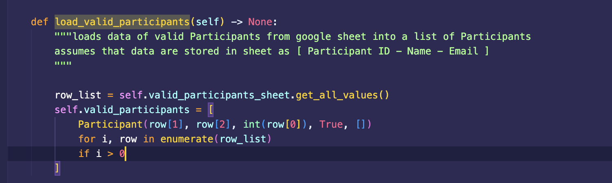
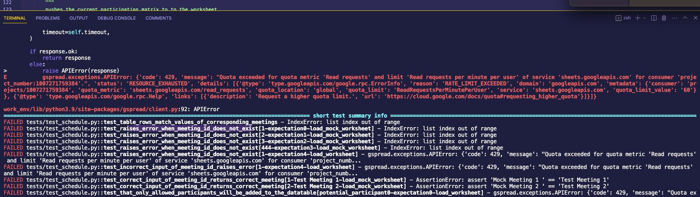
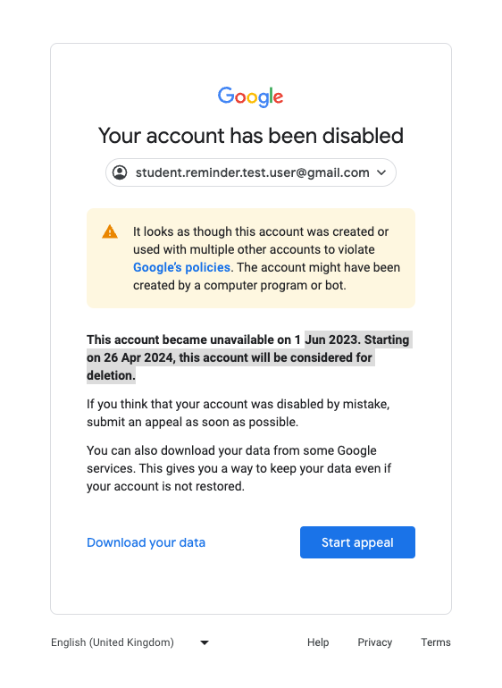

# Lesson learned for Automated Testing of Google Sheet API

During the implementation of the project, it was considered to be a good idea to also include the read/write access of the Google Sheets in the Unit Tests. The approach that was used in this problem turned out to be wrong and we don't advice to reproduce these tests as they lead to Google disabling the account that was used for Unit Testing. 

The approach was : 
-  add a fourth sheet 'unit-test' to the sheet
- This sheet was not used during the main application and only be called during the unit tests. Reason for this was that the unit test needed a reproducible starting state. If the UT would use the main `schedule` sheet , the result would depend on the main sheet which a user could edit, which would lead to a false negative( the read/write methods are correct but the unit test fails). 
- There are a few strategies to mitigate this problem including mocking of the worksheet. A better option was suggested on [stackoverflow]( https://stackoverflow.com/questions/1217736/how-to-write-unit-tests-for-database-calls) to instead connect to a known database and test the code with those sheets
- I modified this idea by adding a fourth sheet 'unit-test' to our google sheet that is not used by the app, just for the unit test, but mimicked exactly the columns as the first (schedule) sheet. This sheet was never to be modifed by the app. We then assumed: if the function works for reading and writing to the fourth sheet, it should work for the first and second as well.
- This is how the unit test worksheet looks like, and and example how values would be read from the sheet during unit test: 
- When running each Unit Test individually, all tests passed

<table style='width:80%'>
    <tr>
        <th style='text-align:center'>Unit Test Worksheet and Example fuction during a unit test</th>
    </tr>
    <tr>
       <td>   </td>
    </tr>
 <tr>
       <td>  
         </td>
    </tr>

   
</table>

- A function call like this (`load_valid_participants` ) accesses the Google sheet and reads all particpants from the Google Sheets API during the Unit Test. Since the sheet cannot modified during the Main App, it would return values that could be tested against during the unit test.

--- 

### Problem with this Approach and its Solution

 - While this approach seemed at first legitimate, it turned out that this approach raises `APIERROR` from the `gspread` library which would make the unit test fail. This was a false negative because the tests passed when running indidivually. The problem with this approach was that i would exceed the quota limit of calls per second (and probably raise a warning of a smart Google algorithm that detects automatic I/O to their sheets)
- There was also a logical error in this approach: What if the admin makes changes to the list valid participants? What if the testing of the write access modifies the sheet and would affect the test for the read access? This could potentially lead to failing unit tests although the function was reading or writing correctly. 

- There were a few options to mitigate this problem : 
  - **Solution 1 :**  Increase the quota of the google sheets [Google Support Question](https://support.google.com/docs/thread/88714701/python-sheet-code-429-quota-exceeded-for-quota-metric-read-requests?hl=en) and reduce number of API calls [gspread documentation](https://docs.gspread.org/en/latest/user-guide.html)
  - **Solution 2 :** Introduce wating times in the unit test to reduce the frequency of the I/O accesss, see [Discussion on Stackoverflow](https://stackoverflow.com/questions/53765222/python-google-sheets-api-limit-429-error-with-loop) and [Google Developers : How to resolve Resolve time-based quota errors](https://developers.google.com/sheets/api/limits#exponential)
  - **Solution 3 :** Remove all API calls from the Unit Test and test only the functionality of the functions.

It was in the end decided to follow Solution 3 to focus only the logic of the calls, and not on the API connection. For this solution, it was then needed to implement `Mock values` for the classes and conditions when to use them. Although it came with the slight disadvantage that an `offline` mode had to be implemented, ultimately it added advantages :  **A)** the unit tests run faster **B)** the results of the unit test were independent of the status of the API (if a connection to the Sheets was not possible, the unit test would still pass). While Solution 1 could have been worthwile too, it would not remove the fact the API calls are bot-like putting at risk permanent  access to Google Sheets.

<table style='width:80%'>
    <tr>
        <th style='text-align:center'>APIError and its consequence</th>
    </tr>
    <tr>
       <td>   </td>
    </tr>
    <tr>
       <td>   </td>
    </tr>
</table>

--- 

### Reflections on the Problem

- It has turned out that this approach was testing two things simultaneously : the connection to the API, and the correctness of the logic of the function. This is not in line with the idea where each unit test  should test a single bit of functionality. 
- While it would have been possible to also mock the entire API, it was decided not to include any type of read/write access to an API in the unit tests based on the advice given on this blog post: [To Mock or Not to Mock
How to escape the mocking hell](https://chemaclass.medium.com/to-mock-or-not-to-mock-af995072b22e)
- I agreed with the author that mocking should  *only* test the access and not how the values from the API are processed. Keeping in mind the scope and time constraints of the project, it was decided not to introduce automatic tests that test specifically the I/O capability. Therefore, the read/write access was only tested `manually`. Once I have more experience with pytest, I would try come back to this problem and find a better solution for automatic testing. 
- Note that it would have been possible to change the API to use a different database provider than the Google Sheets. However, the lesson of strictly seperating tests for API I/O and the functional logic of the program will still apply for all future databases and was found to be a valuable lesson, and may save some future bugs that may have been overshadowed by ignoring the problem.