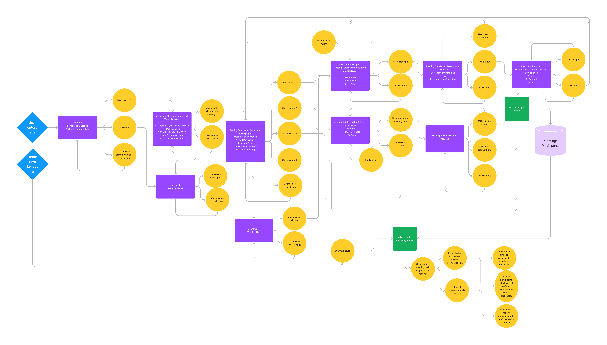
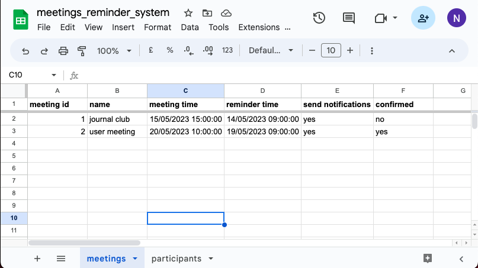
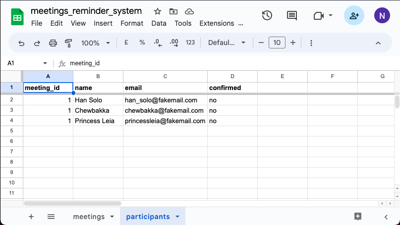
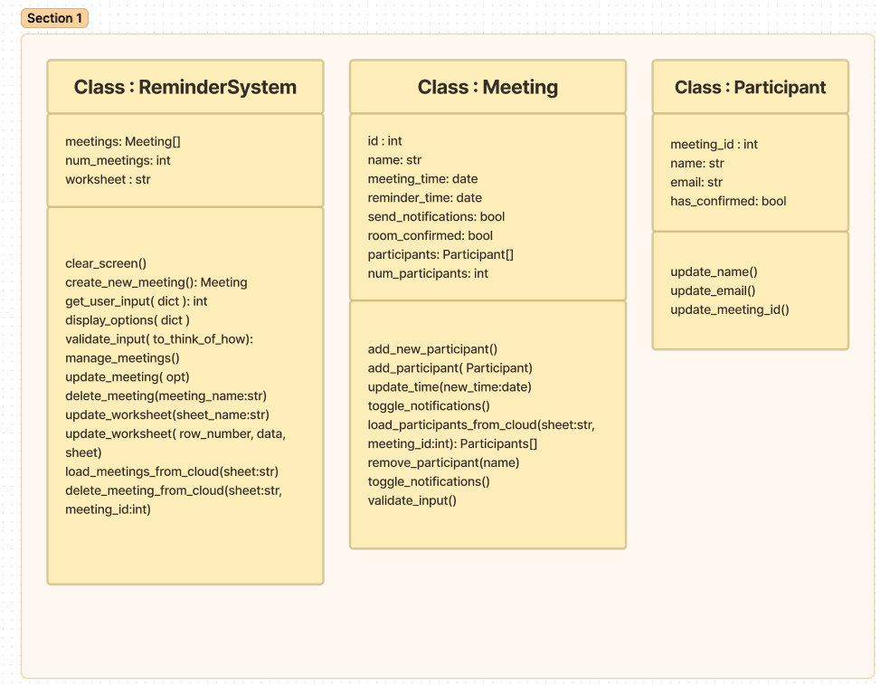

# Meetings reminder system 

This python-based web app is designed to automize meeting reminders. It automizes a specific  repetitive task that commerical solutions such as Outlook currently don't offer. The system keeps track of open meetings, sends emails to participants to either confirm their assistance (if they haven't confirmed 24hrs prior to the meeting) or a default reminder if they have already confirmed. It also automatically sends an email to the facility management if the availability of the meeting room has not been confirmed 24hrs prior to the meeting.

Link to the live terminal : TO DO 

--- 

## Table of Contents

----
## User Experience (UX)

### User Stories 

As a user...
<ol>
    <li> I want to be create a new meeting </li>
    <li> I want to delete a meeting that i have created before </li>
    <li> I want to see all my upcoming meetings</li>
    <li> I want to modify the meeting time of an upcoming meeting</li>
    <li> I want to add a participant to an upcoming meeting</li>
    <li> I want to remove a participant from an upcoming meeting</li>
    <li> I want to add a note to a meeting</li>
    <li> I want to remove a note from a meeting</li>
    <li> I want to modify a meeting note</li>
    <li> I want turn notifications off for a meeting where they were switched on </li>
    <li> I want turn notifications on for a meeting where they were switched off </li>
    <li> I want all participants of my meeting to automatically receive a notification email if they have not confirmed his assistance (12:00 on a day before the meetings)  </li>
    <li> I want all participants of my meeting to automatically receive a reminder email if they have confirmed his assistance (12:00 on a day before the meetings)  </li>
    <li> I want the system to automatically send a reminder email to the facility manager if the meeting room has not been confirmed (12:00 a day before the meeting)</li>
</ol>

### Website Aims

<ul>
    <li> add an automation task that requires low-level attention to repeating events or meetings </li>
    <li>  reduce likelihood that meetings are missed, or that participants do not attend a meeting </li>
</ul>

### How these needs are addressed

- Item 1
- Item 2

### Opportunities 

<table  style="margin: 0 auto; width: 80%">
    <tr >
        <th > Description </th>
        <th> Impact </th>
        <th> Feasibility </th>
    </tr>
    <tr>
        <td> Create a new meeting  </td>
        <td> 5  </td>
        <td> 5  </td>
    </tr>
    <tr>
        <td> Delete a meeting  </td>
        <td> 5  </td>
        <td> 5  </td>
    </tr>
     <tr>
        <td> Add participants to meeting   </td>
        <td> 5  </td>
        <td> 5  </td>
    </tr>
        <tr>
        <td>  Remove participants from meeting   </td>
        <td> 5  </td>
        <td> 5  </td>
    </tr>
    <tr>
        <td >  Add notes to a meeting    </td>
        <td> 5  </td>
        <td> 5  </td>
    </tr>
    <tr>
        <td style="max-width:200px"> Send reminders to participants who have not confirmed assistance (24hrs before meeting)   </td>
        <td> 5  </td>
        <td> 5  </td>
    </tr>
     <tr>
        <td>Send reminders to oneself if meeting itself has not been confirmed  (24hrs before meeting)  </td>
        <td> 5  </td>
        <td> 5  </td>
    </tr>
  <tr>
        <td> Display list of upcoming meetings and allow to browse details </td>
        <td> 5  </td>
        <td> 5  </td>
    </tr>
     <tr>
        <td> allow to turn on/off notifications for each meeting and/or participant </td>
        <td> 3  </td>
        <td> 4  </td>
    </tr>
     <tr>
        <td> connect to a web app that checks Microsoft Outlook Calender </td>
        <td> 2 </td>
        <td> 4 </td>
    </tr>
     <tr>
        <td> connect to a web app to check availability of participants when choosing a time ( i.e. by using Microsoft Outlook Calender) </td>
        <td> 2 </td>
        <td> 2 </td>
    </tr>
    

</table>

--- 

### Feature selection

----- 

## Design

### Imagery

---

## Wireframes

### Program Flow Chart

The functionality of the python program is displayed below. 

<table>
    <tr>
        <th style='text-align:center'> Flow Chart - Python</th>
    </tr>
    <tr>
        <td>   </td>
    </tr>
</table>

--- 

### Data Structures

The information about meetings and participants will be stored using Google sheets: 

<table style='max-width:80%; text-align: center'>
    <tr>
        <th style='text-align:center'> Python Class</th>
        <th style='text-align:center'> Flow Chart - Python</th>
    </tr>
    <tr>
        <td> Meeting Data </td>
        <td>   </td>
    </tr>
   <tr>
        <td> Particiant Data </td>
        <td>   </td>
    </tr>
</table>

--- 

### Implementation in Python  

Two main classes will be used to describe the workflow
- Meeting Class: to describe details of the meeting (that consists of participants)
- Participant Class: to describe details of the participant
- UserManager Class: to handle user inputs from the terminal 
- ReminderManager Class: to handle email reminders to the participants 
- WorksheetHandler Class : to implement common I/O functions with google sheets

<table style='max-width:70%'>
    <tr>
        <th style='text-align:center'> Python : Classes</th>
    </tr>
    <tr>
        <td>   </td>
    </tr>
</table>

----- 

## Features

### General Features 

### Future Implementations

### Accessibility

--- 

## Technologies Used 

-  Git / [Github](https://github.com/)  for Version Control 
- [VS Code ](https://code.visualstudio.com/) as local IDE  
- [ Code Anywhere ](.codeanywhere.com) as cloud IDE 
- [Figma](https://www.figma.com/) for the Flowchart 
- [W3 Validation Tools](https://validator.w3.org/) for Testing
- [Shields.io](https://shields.io/) for Readme badges
- [Markdown Beautifier](https://markdownbeautifier.com/#)  to format tables in this Readme
- convert markdown tables to html via [HTML Table Converter](https://tableconvert.com/markdown-to-html)
- Markdown [TOC Generator](https://ecotrust-canada.github.io/markdown-toc/)
- [Prettier](https://marketplace.visualstudio.com/items?itemName=esbenp.prettier-vscode) VS Code formatter 
- [Pseudo](https://marketplace.visualstudio.com/items?itemName=willumz.generic-pseudocode) VS Code plugin to write pseudocode

### Languages 

- HTML 
- Python

### Frameworks 

-  

### Python Packages 

<table style='max-width:70%'>
    <tr>
        <th style='text-align:center'>  Name</th>
        <th> Purpose </th>
    </tr>
    <tr>
        <td> ssl </td>
        <td> to securely connect to email server  </td>
    </tr>
    <tr>
        <td> email / ezgmail  </td>
        <td>  to send emails from python  </td>
    </tr>
     <tr>
        <td> pytest </td>
        <td>   for unit tests  </td>
    </tr>  
       <tr>
        <td> email_validator </td>
        <td>   to validate that email has correct form  </td>
    </tr>  
    
</table>

----- 

## Deployment and Local Development 

### Deployment on Heroku 

#### How to Fork

#### How to Clone

--- 

## Testing 

### Testing Procedure 
The website was tested extensively for several apsects , and the results were documented in [---TO DO ---TESTING.md](./TESTING.md) 

- Functionality
- User Stories
- Usability and Accessibility 
- Compatibility and Responsiveness 

Also, this website was developed using a `test-driven development` (TDD) approach using the `pytest` framework for python. Results of of the unit tests are documented in same document above. The reasons for TDD is to 
- ... ensure core functionality
- ... better code re-usability 
- ... better code readibility by enforcing smaller functions.

(clean code principles).

---

### Solved Bugs 

### Open Bugs 

---- 

## Credits 

### Code Used

- How to write emails from python [Link](https://towardsdatascience.com/how-to-easily-automate-emails-with-python-8b476045c151)
- How to schedule a python task on Heroku [Link](https://www.youtube.com/watch?v=qn3Obj56wfA)

### Content 

- All of the content was written by myself.
- Externally used code (such as code snippets from stackoverflow) in this project are referenced in this Readme and inside the html or python source code. 

## Acknowledgements

- Teaching and Support from Code Insitute [Code Insitute](https://codeinstitute.net/)
- Example Readme from Kera Cudmore [Kera's Github](https://github.com/kera-cudmore/readme-examples/blob/main/milestone1-readme.md)
- Images from  [Pexels](https://pexels.com/)  in case you use a BG image (check this!)
- examples from pytest about parametrized tests [pytest docs](https://docs.pytest.org/en/7.1.x/example/parametrize.html) 
- tutorials for unit python unit testing with pytest (update this once you started using it) 
    - Pytest Unit Testing Tutorial - How to test your Python code [pixegami (Youtube)](https://www.youtube.com/watch?v=YbpKMIUjvK8)
    - why to use dataclass decorators [mCoding (Youtube)](https://www.youtube.com/watch?v=vBH6GRJ1REM)
    - Automated Testing in Python with pytest, tox, and GitHub Actions [mCoding (Youtube) ](https://www.youtube.com/watch?v=DhUpxWjOhME)
    - Pytest: How to use fixtures as arguments in parametrize [Article](https://engineeringfordatascience.com/posts/pytest_fixtures_with_parameterize/)
- Talks from Dylan Israel about Unit Testing: [Clean Code (Youtube)](https://youtu.be/YQsU2Zq2Zis) 
- Last but not least : Thanks to my mentor Ronan (Code Institute) for his advices and clear feedback 

--

 
 
 
 
 
 
 
 
 
 
 
 
 

Welcome,

This is the Code Institute student template for deploying your third portfolio project, the Python command-line project. The last update to this file was: **March 14, 2023**

## Reminders

- Your code must be placed in the `run.py` file
- Your dependencies must be placed in the `requirements.txt` file
- Do not edit any of the other files or your code may not deploy properly

## Creating the Heroku app

When you create the app, you will need to add two buildpacks from the _Settings_ tab. The ordering is as follows:

1. `heroku/python`
2. `heroku/nodejs`

You must then create a _Config Var_ called `PORT`. Set this to `8000`

If you have credentials, such as in the Love Sandwiches project, you must create another _Config Var_ called `CREDS` and paste the JSON into the value field.

Connect your GitHub repository and deploy as normal.

## Constraints

The deployment terminal is set to 80 columns by 24 rows. That means that each line of text needs to be 80 characters or less otherwise it will be wrapped onto a second line.

---

Happy coding!
