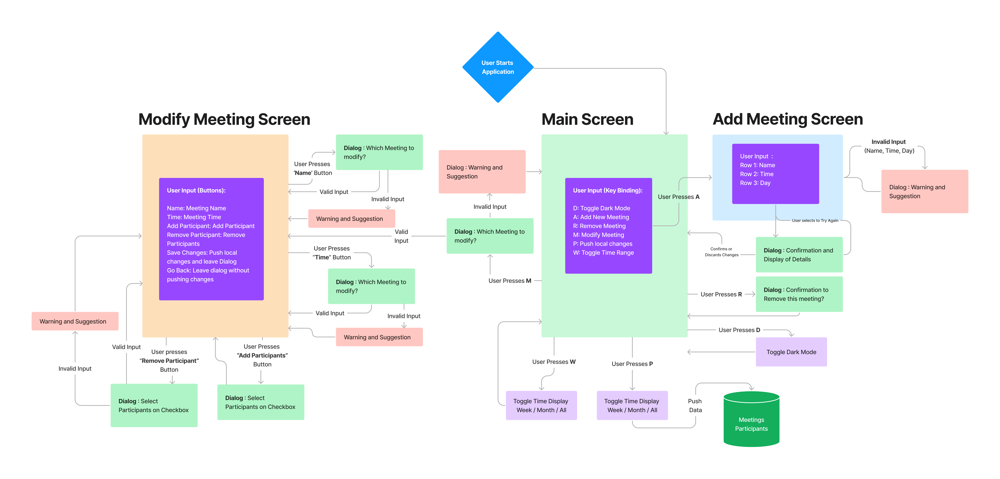

# Meeting Manager

This python-based terminal app is designed to organize personal meeting schedules. The goal is to provide a  time-management tool to keep track and modify scheduled meetings directly within the terminal. This is achieved by creating a Terminal User Interface (TUI) that works directly within the terminal - no need to open and wait for an external calender application to start. 

Link to a live terminal (for demonstration purposes): [Meeting Manager on Heroku](https://meeting-reminders.herokuapp.com/)


<br>
<br>
[<b>Add an image of the App Here </b>]
<br>
<br>
<br>
<br>


--- 

## Table of Contents

- [Meeting Manager](#meeting-manager)
  - [Table of Contents](#table-of-contents)
  - [User Experience (UX)](#user-experience-ux)
    - [User Stories](#user-stories)
    - [Application Aims](#application-aims)
    - [Opportunities](#opportunities)
    - [Feature selection](#feature-selection)
  - [Design](#design)
    - [Screen Flow and Design Considerations](#screen-flow-and-design-considerations)
    - [Data Model](#data-model)
    - [Implementation in Python](#implementation-in-python)
  - [Features](#features)
    - [General Features](#general-features)
    - [Main Screen](#main-screen)
      - [Filter Display of Upcoming Meetings](#filter-display-of-upcoming-meetings)
      - [Toggle Dark Mode](#toggle-dark-mode)
      - [Push Changes](#push-changes)
    - [Add Meeting Screen](#add-meeting-screen)
    - [Modify Meeting Screen](#modify-meeting-screen)
      - [Changing the Meeting Name](#changing-the-meeting-name)
      - [Changing the Meeting Time](#changing-the-meeting-time)
      - [Adding Particpants](#adding-particpants)
      - [Removing Particpants](#removing-particpants)
    - [Explanation of the Data Model](#explanation-of-the-data-model)
      - [Schedule Sheet](#schedule-sheet)
      - [Participant Sheet](#participant-sheet)
      - [Participation-Matrix Sheet](#participation-matrix-sheet)
    - [Future Implementations](#future-implementations)
    - [Accessibility](#accessibility)
  - [Technologies Used](#technologies-used)
    - [Languages](#languages)
    - [Frameworks](#frameworks)
    - [Python Packages](#python-packages)
  - [Deployment and Local Development](#deployment-and-local-development)
      - [How to Fork](#how-to-fork)
      - [How to Clone](#how-to-clone)
    - [(Optional) How to set up your local python environment](#optional-how-to-set-up-your-local-python-environment)
      - [Set Up Worksheets](#set-up-worksheets)
    - [Link Google API to the application](#link-google-api-to-the-application)
    - [Deployment on Heroku](#deployment-on-heroku)
  - [Testing](#testing)
    - [Testing Procedure](#testing-procedure)
    - [Solved Bugs](#solved-bugs)
    - [Open Bugs](#open-bugs)
  - [Credits](#credits)
    - [Code Used](#code-used)
    - [VS Code Extensions:](#vs-code-extensions)
    - [Content](#content)
  - [Acknowledgements](#acknowledgements)


----
## User Experience (UX)


### User Stories 

<table  style="margin: 0 auto; width: 90%; ">
    <tr >
        <th style="min-width:20%">  </th>
        <th style='text-align:center' > USER STORIES </th>
    </tr>
    <tr>
        <td style="min-width:20%"> 1 </td>
        <td> I want to be able to filter my upcoming meetings so that I can see the upcoming meetings for the current week, the current month or all meetings quickly.   </td>
    </tr>
    <tr>
        <td> 2 </td>
        <td> I want to be able to add a new Meeting to my schedule where i can freely set the meeting name, meeting time and date.   </td>
    </tr>
    <tr>
        <td> 3 </td>
        <td> I want to be able to modify the details of an existing meeting, so that i can correct and react to changes to the plan, by changing the meeting time or the meeting name.   </td>
    </tr>
    <tr>
        <td> 4 </td>
        <td>  I want to be able to remove a Meeting from my schedule, so that it is not in the schedule any more, for example if the meeting was cancelled.   </td>
    </tr>
    <tr>
        <td> 5</td>
        <td>  I want to be able to add and remove participants to a meeting after a meeting has been created so that i can react to changes in the outer world (i.e. a participant had to cancel their attendance after originally having agreed to attend) </td>
    </tr>
    <tr>
        <td> 6 </td>
        <td> When i make changes to the meeting schedule, I want to be able to save those changes so that they are still there when I open the application the next time. 
        </td>
    </tr>
    <tr>
        <td> 7 </td>
        <td>  While using the application, I want to have an option to discard the local changes and reset the schedule from the database.
        </td>
    </tr>
    <tr>
        <td> 8 </td>
        <td> I want to be able to quickly change the time range how the upcoming meetings are displayed. In this way, I can quickly get an overview of the meetings from the current week, the current month, and all meetings that are scheduled.  </td>
    </tr>
    <tr>
        <td> 9 </td>
        <td> I want to be able to toggle the display into dark mode so that I can also easily read the information also with darker light conditions.   </td>
    </tr>
</table>

--- 

### Application Aims

<ul>
    <li> create a schedule manager that provides time management to the user  </li>
    <li> fast access to a meeting schedule directly within the terminal (no need to open Outlook)  </li>
</ul>

### Opportunities 


<table  style="margin: 0 auto; width: 80%">
    <tr >
        <th>  # </th>
        <th> Feature </th>
        <th> Impact </th>
        <th> Feasibility </th>
    </tr>
      <tr>
        <th> 1 </th>
        <td> Add new meetings to schedule, and remove scheduled meetings that are cancelled  </td>
        <td> 5  </td>
        <td> 5  </td>
    </tr>
    <tr>
        <th> 2 </th>
        <td> Modify details of a scheduled meeting (including changes of time, meeting name and participants ) </td>
        <td> 5  </td>
        <td> 5  </td>
    </tr>
     <tr>
        <th> 3 </th>
        <td> Create and add participants to a meeting, and remove them from a scheduled meeting  </td>
        <td> 5  </td>
        <td> 4  </td>
    </tr>
  <tr>
        <th> 4 </th>
        <td> Display the list of upcoming meetings and allow to browse details. Let the user see quickly the scheduled meetings for the current week and current month </td>
        <td> 5  </td>
        <td> 5  </td>
    </tr>
    <tr>
        <th> 5 </th>
        <td > Send automatic reminder Emails to each participant and attach a note to thes reminder emails   </td>
        <td> 3  </td>
        <td> 4  </td>
    </tr>
 
</table>


--- 

### Feature selection

- **Features 1,2,4** seemed appropriate and within scope of the project and capability of the development team. 
- Regarding **Feature 3**: it was decided to **not** allow the user of the application to create an arbitary participant. While it seemed initially a good idea to allow arbitrary participants, it raised security issues especially if this system is combined with the ability to send reminder Emails - a malicious user could send Emails to arbitrary addresses and spam mails.   
    - Solution : Instead of allowing arbitrary participants, another datasheet was added to the model with a pool of allowed participants that the user can select from. I considered this not to be a major limitation, since most meetings that this application aims for are repetitive meetings with the same people.
    - In a future extension of this application, the user could send a request to add a user to an administrator of the system. Once approved, this participant could be added to the protected pool of participants.
- Regarding **Feature 5** : It was decided to not add this implementation to this application as it would have increased significantly the complexity of the project including an implementation that is acceptable also in terms of security, code readibility, deployability and the encapsulation priniciple. Especially the fact that the terminal application would have to be operate securely both on the Code Institute Terminal on Heroku (as per assessment criteria) and on a local terminal would increase the complexity beyond the scope of the project. 
    - Solution: It was decided that the capability to send Emails  needs to be handled by a separate, dedicated application (which could work on the database managed by this application). It also would reflect better the prinicple of encapsulation to have one application for managing the meeting schedule, an another application that manages Email reminders: the database in this application is already designed with this scenario in mind. 
    - In fact, it would be the most appropriate to add a third terminal application in this cosmos to handle the administration and validation for adding people to the datasheet of allowed participants.

----- 

## Design

### Screen Flow and Design Considerations

The Screen Flow of this Application is visualized below. At any point it is taken care that invalid user interactions, such as supplying invalid Date or selecting meetings to modify that don't exisit, are handled gracefully, with the user getting feedback with a reason for the failure. 
- After supplying invalid input, the user is given a chance to repeat their input at any given point gracefully. Feedback in the Warning Dialog should guide by finding error why the input was invalid 
- It is taken care that at any point the input does not lead to program errors.
- It is anticipated that users eventually will forget to push their latest changes. To avoid these 'soft' user errors, a visual status whether the table is in sync with the remote data is displayed giving the user a visual aid to avoiding this error 
- Note that a user of this applicaiton *cannot* add arbitrary participants **by design**.  This is to anticipate accidental 'soft' errors such as mis-spelling an Email address or Names. It also counters users with malicious intent that would send emails or spam to unwanted addresses. 
- Note also that, while this application cannot send Emails to the participants, such as reminder Emails, it is designed to work together with an application on the same database that **only** handles the sending of reminder Emails on a scheduled basis. 

<table  style="margin: 0 auto; width: 100%">
    <tr >
        <th style="text-align:center">  SCREEN FLOW  </th>
    </tr>
      <tr>
        <td>  </td>
    </tr>
</table>

---

### Data Model

The data in this applications is modelled as following.

<table  style="margin: 0 auto">
    <tr>
        <th>  Class </th>
        <th>  Description </th>
        <th>  Attributes </th>
    </tr>
    <tr>
        <td style="width:10%"> <b>Schedule</b> </td>
        <td style="width:60%"> Consists of a collection of meetings. A schedule has also a Worksheet that can send and receive data from the Goggle Sheets API  </td>
        <td> 
            <ul>
                <li> Name </li>
                <li> Worksheet </li>
                <li> List of Meetings </li>
                <li> List of allowed Participants </li>
            </ul>
         </td>
    </tr>
    <tr>
        <td style="width:10%"> <b> Meeting </b> </td>
        <td style="width:60%"> Consists of a collection of participants. It has an unique "Meeting ID" that is used throughout the application to refer to a particular instance of a meeting. </td>
        <td> 
            <ul>
                <li> Name </li>
                <li> Time </li>
                <li> List of Participants </li>
                <li> Meeting ID </li>
            </ul>
         </td>
    </tr>
    <tr>
        <td style="width:10%"> <b> Participant </b> </td>
        <td style="width:60%"> Smallest Unit in this Application. It has an unique "Participant ID" that is used throughout the application. This ID also enables to store the information which meeting a particular participant attends - could be a single meeting, but could be multiple <b> see section #Participation Matrix (TO BE ADDED) </b> </td>
        <td> 
            <ul>
                <li> Name </li>
                <li> Email Address </li>
                <li> Participant ID </li>
            </ul>
         </td>
    </tr>
     <tr>
        <td style="width:10%"> <b> Worksheet </b> </td>
        <td style="width:60%"> Handles the interface to the Google Sheets API and enables read/write access to a remote location , so that changes to the schedule can be stored permanently. </td>
        <td> 
            <ul>
                <li> Name </li>
                <li> Schedule Sheet </li>
                <li> List of allowed Participants (just to add another layer of safety with some redundance)</li>
            </ul>
         </td>
    </tr>
</table>

A more graphical depiction of this Data Model can be seen in the following diagram. 

<table  style="margin: 0 auto; width: 100%">
    <tr>
        <th style="text-align:center">  DATA MODEL </th>
    </tr>
    <tr>
        <td>  </td>
    </tr>
     <tr>
     <td>
     <b>Figure : Data Model. </b>This illustration depicts the hierarchy. The App consists of a unique schedule, which consitsts of a collection of the meetings. A Meeting itself consists of a collection of participants.
     </td>
    </tr>
</table>


--- 

### Implementation in Python  

The layout of the implementation is divided into three separate Apps. Note that in this repository, only the `MeetingsApp` is discussed and included. But for sake of completeness, and to stress the design choices, these are the:

-  MeetingsApp : The main User Terminal Application where the user can interact with the Meeting schedule
-  ReminderApp : A small worker application that sends reminders based on the Meeting schedule 
-  ParticipantsApp : A small worker application that handles approval requests for adding new participants 

Note that in this repository, only the main `MeetingsApp` application is presented. It was chosen to implement rather this application over the others for the following reasons:
1. The `MeetingApp` has a value in itself. Think of how long it usually takes until your calender opens, or if you check  your calender on a website to check your schedule, including the time to switch from terminal. What if you are working on a cloud and don't have a graphical UI at hand? A time-management tool that pops up within a second while being in a terminal, and then pops back to the terminal with ctrl-c - *isn't that a neat thing*? 
2. It was more complex than just the implementation of the helper apps as it involved a higher multitude of input parameters. Why not go the extra mile. Also, by designing the worksheets, most of the work for the other two applicaiton is already done. 
3. Time constraints and Mindfulness about the scope of the Application - a working application with this particular functionality should pass already all requirements for the Portfolio Project. Also, last but not least, an correct explanation of the deployment of three separate Apps that each *may* or *may not* work on Heroku *or* on a local computer would end up being *very* long , and more likely to include mistakes.

-----

## Features

### General Features 

The application consists of three main screens using a terminal user interface (TUI):
-  `Main Screen `: this is entry point when starting the applicaiton, also the center of the application where the other screens pop from. Displays the schedule of upcoming meetings. 
-  `Add Meeting Screen` : a screen where the user enter details such as **Name**, **Time** and **Date** of a new Meeting
- `Modify Meeting Screen` : a screen where the user can change details of a particular meeting from the schedule, such as **remove** or **add** participants, or change **Date**, **Time** and **Name** of a scheduled meeeting.  

On each screen, confirmation dialogs and warning messages about invalid inputs are implemented as semi-transparent popup screens that are popped on top of the current screen.


--- 

### Main Screen 


- This is the entry point when you start the application from the terminal.
- For fast navigation to the other screen, key bindings are added as following :
    - A: Opens a screen to add new Meeting 
    - R: Opens a dialog to remove a meeting
    - M: opens a screen to modify a meeting  
    - P: push local changes to google sheets
    - W: Filter table  : This Week / This Month / All Meetings 
    - D: Toggle Dark Mode
- If you run the app on a regular terminal (not the Heroku version), it has has clickable buttons (try clicking on footer elements on this page, or on a button when a dialog pops up)

<table style="width:100%;">
    <tr>
        <th>   MAIN SCREEN </th>
    </tr>
    <tr>
        <td>     </td>
    </tr>
    <tr>
        <td>  
         
         </td>
    </tr>
    <tr>
        <td>
         
         </td>
    </tr>
    <tr>
    <td>
         
         </td>
    </tr>
</table>


####  Filter Display of Upcoming Meetings

- The user can filter the table by pressing the `W` key on the Main Screen
- Repeatedly pressing of `W` changes the filter and cycles through 'This Week' - 'This Month' - 'All Meetings' 

<table style="width:100%;">
    <tr>
        <th> MAIN SCREEN - FILTER MEETINGS </th>
    </tr>
    <tr>
        <td>  
          
         </td>
    </tr>
    <tr>
        <td>  
          
         </td>
    </tr>
    <tr>
        <td>
          
         </td>
    </tr>
</table>


#### Toggle Dark Mode

- The user can toggle to Dark Mode by pressing the `T` key on the Main Screen
- Repeatedly pressing of `T` toogle through Dark Mode On/Off

<table style="width:100%;">
    <tr>
        <th> MAIN SCREEN - DARK MODE </th>
    </tr>
    <tr>
        <td>  
          
         </td>
    </tr>
    <tr>
        <td>  
          
         </td>
    </tr>
</table>

#### Push Changes 

- The user can push local changes to the Google Sheet by pressing the `P` key on the Main Screen
- After the operation is finished, a dialog pops up whether it was successful or not 

<table style="width:100%;">
    <tr>
        <th> MAIN SCREEN -PUSH CHANGES </th>
    </tr>
    <tr>
        <td>  
          
         </td>
    </tr>
</table>

---

### Add Meeting Screen 

- The user gets to this screen when pushing 'A' key on the Main screen
- On top of the screen is a description of the expected Format for the Date `DD/MM/YY` and Time `HH:MM`
- Using the `Tab` key, or using `mouse click` (not Heroku), the user can focus an Input and type the details of a new meeting
- After submitting by pressing `Enter` while focussing any of the input forms, a dialog pops up with the input, where the user can either confirm, discard or try to enter again.
- If the user inputs with an invalid input, he will get informed about his error, and what format was expected 


<table style="width:100%;">
    <tr>
        <th>   ADD MEETING SCREEN </th>
    </tr>
    <tr>
        <td>     </td>
    </tr>
    <tr>
        <td>  
         
         </td>
    </tr>
    <tr>
        <td>
         
         </td>
    </tr>
</table>

---
### Modify Meeting Screen 

- The user gets to a dialog to select a meeting to modify by pushing 'M' key on the Main Screen
- If the user enters an invalid ID, a dialog pops up with the input and a warningst
- Once entered a valid meeting ID (as visible from the table), the Modify Meeting Screeps pops up
- On upper part of the screen :
    - A row of a datatable with the current values of the meeting to be modifed 
    - A second datatable with a list of participants of that meeting (in this case, the list is still empty)
- On the lower part of the screen is a selection of Buttons that allow different types modifcations :
    - `Time` Button : opens a dialog to modify the meeting time
    - `Name` Button : opens a dialog to modify the meeting name
    - `Add Participant` Button : opens a checkbox dialog to add participants
    - `Remove Participant` Button : opens a dialog to remove a participant from the meeting 
    - `Save Changes` Button : saves the local changes and returns to Main Screen
    - `Go Back` Button : discards the local changes and returns to Main Screen
- All changes on this Screen are is still just local changes. 
- To make these changes permanent, they need to be pushed to the remote Google API database on the Main Screen
- This behaviour was a design decision to deal with situations where the user wants to to discard changes. It is figured to be easier to re-do local changes than trying to track what has been changed by accident (but it probably would be up to a discussion and a proper testing phase with the client if that is the desired behaviour).  

<table style="width:100%;">
    <tr>
        <th>  MODIFY MEETING SCREEN </th>
    </tr>
    <tr>
        <td>   </td>
    </tr>
     <tr>
        <td>     </td>
    </tr>
     <tr>
        <td>   </td>
    </tr>
</table>

#### Changing the Meeting Name 

- The first action on this screen is to change the name of the meeting 
- The user presses the `Name` Button
- A dialog pops up where the user can enter a Name and then either confirm or go back without changing.
- If confirmed, the new meeting name is updated in the data table


<table style="width:100%;">
    <tr>
        <th>  MODIFY MEETING SCREEN - CHANGE MEETING NAME</th>
    </tr>
    <tr>
        <td>     </td>
    </tr>
    <tr>
        <td>     </td>
    </tr>
</table>

#### Changing the Meeting Time 

- The next action on this screen is to change the time of the meeting 
- The user presses the `Time` Button
- A dialog pops up where the user can enter a Name and then either confirm or go back without changing. The dialog includes a hint with the expected format for the time input `DD/MM/YY`
- If the user inputs with an invalid input, he will get informed about his error, and what format was expected
- If confirmed, the new meeting name is updated in the data table

<table style="width:100%;">
    <tr>
        <th>  MODIFY MEETING SCREEN - CHANGE MEETING TIME</th>
    </tr>
    <tr>
        <td>     </td>
    </tr>
    <tr>
        <td>     </td>
    </tr>
    <tr>
        <td>     </td>
    </tr>
</table>

#### Adding Particpants 

- Another action on the 'Modify Meeting' Screen is to add participants to a meeting
- The user presses the `Add Participants` Button
- A dialog pops up with a checkbox of participants. The user can select, either by focusing with `TAB` and then pressing `ENTER`, or by clicking with the mouse on the particitpant ( mouse events don't work on Heroku terminal).
- Once made a selection of participants to add, the user can confirm, and the new meeting name is updated in the data table by pressin the `Confirm` Button, or discard the changes by pressing `Go Back` Button
- The participant were loaded from the worksheet with their Email and other information. These information cannot be changed in the app  **by design** (see reasoning for this in this section [Features and Design Decisions](#screen-flow-and-design-considerations)). 
- As a solution, the participants can be selected from a checkbox, and details about the participant (ID, Email, contact, meetings that this participant is taking part) are loaded in the background and partly displayed in the table of the Screen


<table style="width:100%;">
    <tr>
        <th>  MODIFY MEETING SCREEN - ADDING PARTICIPANTS </th>
    </tr>
    <tr>
        <td>     </td>
    </tr>
    <tr>
        <td>     </td>
    </tr>
    <tr>
        <td>     </td>
    </tr>
</table>


#### Removing Particpants 

- Another action on the 'Modify Meeting' Screen is to remove participants from a meeting
- The user presses the `Remove Participants` Button
- A dialog pops up with a where the user can enter a participant ID with the participant he want to remove from the meeting  
- Once made a selection, the user can press the `Confirm` Button, or discard the changes by pressing `Go Back` Button
- If the user entered an invalid ID, he will get informed about his error, and what ID entered 
- if the user entered a valid ID, the participant returns to the 'Modify Meeting' Screen where it can be seen that the participant has been removed from the list of participants of that meeting 

<table style="width:100%;">
    <tr>
        <th>  MODIFY MEETING SCREEN - REMOVING PARTICIPANTS </th>
    </tr>
    <tr>
        <td>     </td>
    </tr>
    <tr>
        <td>     </td>
    </tr>
    <tr>
        <td>     </td>
    </tr>
</table>


---

### Explanation of the Data Model 

The schedule should be available even after the application is closed. This app uses the Google Sheets API to permanently store: 
- Currently scheduled meetings 
- A pool of participants that can potentially be added to a meeting
- A participation matrix that represents the attendence of participants in the scheduled meetings 

#### Schedule Sheet

- Stores all current meetings on the schedule that are loaded when the app starts
- The sheet contains columns for : 
    - Meeting ID : A unique ID number (0-1000)
    - Name : Name of Meeting
    - Time : Time of Meeting
    - Place : Place of Meeting (Not implemented)
    - Number of participants: Number of participants that attend the meeting
    - Reminder Email sent : if an Email has been sent already, to avoid sending duplicate Emails (not used in this app)

<table style="width:100%;">
    <tr>
        <th> SCHEDULE WORKSHEET </th>
    </tr>
    <tr>
        <td>     </td>
    </tr>
</table>


#### Participant Sheet

- Stores all **valid** participants that could be added to a meeting - Note that you cannot create participants from within the app for security / fail-safe reasons (i.e. typo in the Email address)
- The sheet is locked and should be read-only in order to prevent changes from within the application. 
- This was achived by creating this sheet with a different owner that **allows only read-only** access for this sheet, while allowing read/write access to the other sheets from the app 
- The sheet contains columns for : 
    - Participant ID : A unique ID number (0-1000) 
    - Name : Name of Participant 
    - Email : Email of the participant 

<table style="width:100%;">
    <tr>
        <th> PARTICIPANT POOL WORKSHEET </th>
    </tr>
    <tr>
        <td>     </td>
    </tr>
</table>

#### Participation-Matrix Sheet

- Stores the participation of participants for all scheduled meetings 
- The columns contain the `Participant ID`numbers of all participants from the allowed-participants pool
- Each rows belongs to a single meeting of the schedule, and the first cell contain the `Meeting ID` 
- Participation of a participant can then then read as: 
    - if (i, j) == TRUE  for Meeting `i` of Participant `j` , the the Participant `j` takes part in meeting `i`
    - in the example below : 
        - Participant with the ID `4`takes part in meeting with ID `1` because `(4,1) == TRUE`
        - Participant with the ID `4`does not take part in meeting with ID `2` because `(4,2) == FALSE`
- From this table, it is internally also calculated how many participants take part by simply summing sum the number of values in a row ( `number of participants in Meeting i = sum(row(i))`)

<table style="width:100%;">
    <tr>
        <th> PARTICIPATION MATRIX WORKSHEET </th>
    </tr>
    <tr>
        <td>     </td>
    </tr>
</table>

---

### Future Implementations

- Integration of the meeting schedule with a personal calender such as Outlook / Gmail calender. This way, the application could make use of the features implemented in those calenders already, and check availability of the participants. 
- Integration of this `MeetingsApp` with a `ReminderApp` that uses a shared database to send reminder Emails on a scheduled basis (such as 24hrs before a meeting), and a `ParticipantsApp` that handles the administration of the participants and approval requests for adding new participants from the `MeetingApp`
- Integration of the meetings app for a more broad meaning of a schedule, such as adding other (personal) events or virtual meetings to a schedule  
- Integration of a personal Meeting Schedule with a schedule from other another users, to allow for social interactions and messages / invitations to meetings or events, or shared calenders.
- A visual cue that informs the user whether the synchronization of the local changes with the Google Sheets has been successful , and that the local repository differs from the Google sheets (Perhaps following a color code such as : Green/Yellow/Red for in sync/modified/error in the repository )
- A Feedback dialog when the synchronization of the local changes with the remote database on Google sheets has finished. Additionally, I am not very happy that the application freezes while it synchronizes with Google Sheets - the next rework would address this problem, perhaps by not loading the entire sheet at a time and only sheets that are queried (for example, there is no need to load the unit-test sheet every time). 


### Accessibility

- The application is entirely controllable via focusable buttons (while on a desktop version allowing for mouse control as an alternative). 
- A toggle for a 'Dark Mode' has been added to allow switching of the displayed colors 

--- 


## Technologies Used 

-  Git / [Github](https://github.com/)  for Version Control 
- [VS Code ](https://code.visualstudio.com/) as local IDE  
- [ Code Anywhere ](.codeanywhere.com) as cloud IDE 
- [Figma](https://www.figma.com/) for the Flowchart 
- [Shields.io](https://shields.io/) for Readme badges
- convert markdown tables to html via [HTML Table Converter](https://tableconvert.com/markdown-to-html)
- [Prettier](https://marketplace.visualstudio.com/items?itemName=esbenp.prettier-vscode) VS Code formatter 
- [Pseudo](https://marketplace.visualstudio.com/items?itemName=willumz.generic-pseudocode) VS Code plugin to write pseudocode


### Languages 

- Python

### Frameworks 

- Pytest for Unit Testing [Link to Homepage](https://docs.pytest.org/en/7.3.x/)

### Python Packages 


<table style='max-width:70%'>
    <tr>
        <th style='text-align:center'>  Name</th>
        <th> Purpose </th>
    </tr>
        <tr>
        <td> textual </td>
        <td> to create a terminal user interface</td>
    </tr>
    </tr>
        <tr>
        <td>  rich </td>
        <td> to create markdown elements for textual</td>
    </tr>
    <tr>
        <td> black  </td>
        <td>  for standarized code formatting </td>
    </tr>
     <tr>
        <td> pytest </td>
        <td>   for unit tests  </td>
    </tr>  
    </tr>  
       <tr>
        <td> coverage </td>
        <td>   to calculate code coverage of pytest </td>
    </tr>  
    <tr>
        <td> email_validator </td>
        <td>   to validate that email has correct form  </td>
    </tr>  
  
</table>


----- 

## Deployment and Local Development 

Most of the features of this application run fine on a local computer (any interactions with the schedule such as read/delete/update meetings etc.). 
 A few notes: 
- For testing, you don't need a worksheet and can try it out directly with the mockdata by pressing 'M' in the main terminal - this will load the mock data used for testing instead of the worksheet
- However, to meet the requirements for assessment, the application will also run fine on Heroku 
- Running on Heroku will also demonstrate how to the schedule can synchronize with a worksheet and how reminders would be send to the selected participants.
- During development, I realized that sending Emails to arbitrary address, and allowing the user to send emails manually involves potential security risks and I will not include these opportunities. Especially because the source code is publicly available here on Github. 
- Instead, the emails will be **only sent automatically** and not manually by pressing a button as originally intended. 
- Also, the user will **not be able to add arbitrary participants** as this could allow hostile users to send Emails on behalf of this application. Instead, the user can select from a list of participants, and the Email sending functionality will run in the background.
- Note that this is not a major limitation regarding the aim of this application since most of the meetings that benefit from automation are those that happen frequently with the same people (i.e. staff meeting, townhall meetings, Journal Club)  

#### How to Fork

- Log into GitHub and navigate to this repository  
- Click on the "Main" Branch button and type the name of the forked branch
- Click on "Create Branch" to confirm

#### How to Clone

- Click on the "Code" button and copy the link to this repository
- open terminal on your machine and navigate to the folder you want to store a local copy
- in the terminal, type 'git clone ' followed by the link you copied
- press enter to confirm

### (Optional) How to set up your local python environment

- If you want to run this application on your local computer
- open terminal and clone repositor repository (see above)
- create local virtual environment by typing in your terminal:  
```
python -m venv work_env 
```
- ensure that your virtual environment is activated. If not, run 
```
source work_env/bin/activate
```
- install requirements from file 
```
pip install -r requirements.txt
```
- The applicaiton should run now with
```
python run.py
```


#### Set Up Worksheets

- Create a personal google account (if needed)
- Go to Sheets
- You can setup your own sheets as per instructions below, or use the example sheet [here](./assets/documentation/example.xlsx)
- Create New Google Sheet Document and give it a name, i.e. `Meeting-Reminders` (or a name of your liking). This Sheet will have three sheets : 
    - A `schedule` sheet to keep track of the planned meetings 
    - A `valid-participants` sheet to list all allowed participants that could be invited to each meeting
    - A `participation-matrix` sheet that stores which meeting each allowed participant attends.

- How to enter details: 
    - Rename first sheet to 'schedule'
    - Add the Headings as seen below 
    - You could add some initial data but I would recommend filling the sheet from within the app to avoid mistakes, only adding the correct headings should be enough.

    <table style='width:80%'>
    <tr>
       <th style='text-align:center'> Schedule Worksheet</th>
     </tr>
      <tr>
       <td>   </td>
     </tr>
    </table>

    - Add a new sheet to the Document and name it 'valid-participants'
    - Add Headings as seen below 
    - I would recommend to add the values exactly as seen in the table below or from the example sheet [here](./assets/documentation/example.xlsx). 
    - Once familiar with the system, you can add your own data 
  
    <table style='width:80%'>
    <tr>
       <th style='text-align:center'>Valid Participants Worksheet</th>
       </tr>
       <tr>
       <td>   </td>
     </tr>
    </table>

    - In the same Document, add a new sheet and name it 'participation-matrix'
        - The easiest way is to copy the values from the example sheet [here](./assets/documentation/example.xlsx). 
        - Just for information : Note that the columns match the valid participants that you entered above. In the example above, the first column is called `Meeting ID/ Participant ID` and is just informative. The next columns `1`, `2`,`3`,`4`,`5` match the `Participant ID` of the valid participants. Each column will indicate to which meeting a valid participant will attend.
        - If you have added a meeting manually, add a row for each meeting, starting with their `Meeting ID` and random values for each column (either `FALSE` or `TRUE`)
        - Note: i would recommend to either start without meetings in the schedule, or with the example sheet ( [here](./assets/documentation/example.xlsx)), and then start adding meetings from within the app.

    <table style='width:80%'>
       <tr>
           <th style='text-align:center'> Participation Matrix Worksheet</th>
       </tr>
       <tr>
       <td>   </td>
        </tr>
    </table>


---- 
### Link Google API to the application 

- Go to Google Cloud Platform 
- Go to Dashboard and Select "New Project"
- Select a Name i.e. "MeetingReminders" and click > Create 
- Click > "Select Project" to go to project page 
- Click on sidebar >  "API and Services" > Library
- For the Google Drive API:
    - Search For "Google Drive" and select "Google Drive API" > Click "Enable" 
    - Click on "Create Credentials" > select "App Data", unselect "Kubernets" etc., then click 'Next'
    - Use an arbitrary Name for the account
    - Select Role "Basic > Editor"
    - Leave Blank the next 
    - Go to your Service Account and Add+Download a private json key from the 'keys' tab and store in a "creds.json" file (don't share this file with anyone and **double-check** that you will not push it accidentally to your github clone/fork. 
    - Before copying into your application folder, **ensure** that the name of your credential file is listed in your **.gitignore** to make sure these **will never be pushed to git**. )
- For the Google Sheets API :
    - Search For "Google Drive" and select "Google Drive API" 
    - Click "Enable" 
- open your creds file and copy the value of the "client_email" key into your clipboard 
- open your google sheet and click "share", and use this email that you copied above
- **IMPORTANT: Never push any sensitive information to your GitHub repository** 
    - this can be handled by a '.gitignore' file inside your repository that tells git to ignore files that are listed in this file
    - before copying your credential file into your repo folder, open '.gitignore'
    - add a new line 'creds.json' to this file (or same name as you saved your private key that your dowloaded in previous step)
    - push changes to github and check that 'creds.json' was not pushed (if you want, try this out first with an empty 'creds.json' before replacing with the actual private key)


---- 

### Deployment on Heroku 

- Heroku will requires public access to the `reminding` package inside your forked repository. Basically i followed [this explanation from Heroku](https://devcenter.heroku.com/articles/python-pip) 
- Create an account on [Heroku](https://dashboard.heroku.com/apps)
- Log into Heroku 
- Go to Dashboard and click on `New` > `New App`
- Choose a name i.e. my-meetings and region (EU) then click on `Create App`
- Connect with your forked repository on github
- Switch to `Settings` Tab
    - Under Config Vars
        -  add `PORT` with value `8000`
        - add `CREDS` and copy the entire content of your `creds.json` into this variable. The CI terminal will use this information to manage access to your google sheet.
    - On `Buildpacks` choose in that order (the order matters)
        -  `heroku/python` 
        -  `heroku/nodejs`
-   Switch to to `Deploy` Tab 
    - If you want to deploy just once, `Manual deply` section > Click on `Deploy Branch` 
    - If you want to deploy automatically after each commit to your repository, choose `Enable Automatic Deploys` on `Automatic Deploys` section

--- 

## Testing 

### Testing Procedure 
This application was tested extensively for several apsects , and the results were documented in [TESTING.md](./TESTING.md):

- Functionality
- User Stories
- Usability and Accessibility 

Also, this application was developed using a `test-driven development` (TDD) approach using the `pytest` framework for python. Results of of the unit tests are documented in same document above. The reasons for TDD is to 
- ... ensure core functionality
- ... better code re-usability 
- ... better code readibility by enforcing smaller functions.

(clean code principles).

---

### Solved Bugs 


Here is a list of the many bugs encountered during the implementation of the project. 

<table style="width:100%;">
    <tr>
        <th>  # </th>
        <th>  Bug Description </th>
        <th>  Solution</th>
        <th>  Screenshot</th>
    </tr>
    <tr>
        <td> 1</td>
        <td> After packaging the python code into an installable package ( so that we can use classes via `from reminding.meeting import Meeting`), the app would not deploy  on Heroku
        </td>
        <td> Setting the visibility of the repository from `private` to `public`. In this way, the `reminding` dependency from this repository could be installed successfully. There are other options for private repositories (see [Heroku Devcenter](https://devcenter.heroku.com/articles/python-pip) or [Stackoverflow ](https://stackoverflow.com/questions/21297755/heroku-python-dependencies-in-private-repos-without-storing-my-password)) but none of these were deemed safe or good practice (i.e. storing private SSH-KEYs as environment variable). Being mindful about the scope of this project, it was chosen to follow the easier and safer approach by setting visibility to 'public'. 
        </td>
        <td style='width:50%'>     </td>
    </tr>
    <tr>
        <td> 2 </td>
        <td> Adding a participant to a meeting that this participant was already part of would cause duplicate entries
        </td>
        <td>   added a check that a participant was already in a meeting in the function to add a participant to a meeting. If the participant was already in the meeting, skip to enter
        </td>
        <td style='width:50%'>      </td>
    </tr>
    <tr>
        <td> 3 </td>
        <td> After adding a new field to a dataclass, a constructor error was thrown 'adding a non-default argument after a default argument"
        </td>
        <td>   add a non-default argument to the dataclass variable
        </td>
        <td style='width:50%'>      </td>
    </tr>
    <tr>
        <td> 4 </td>
        <td> TypeError after trying to write a `datetime` variable into a JSON
        </td>
        <td>   convert datetime object into a string using its `strftime` function see [Stackoverflow](https://stackoverflow.com/questions/10624937/convert-datetime-object-to-a-string-of-date-only-in-python)
        </td>
        <td style='width:50%'>      </td>
    </tr>
    <tr>
        <td> 5 </td>
        <td> Logical Error in Unit Test
        </td>
        <td>   This was a logical error : The unit Test used the same google sheet that was also used by the main application. The solution was to create a dedicated read-only 'unit-test' sheet that was not modified by the app and could therefore be used during testing.
          </td>
        <td style='width:50%'>      </td>
    </tr>
     <tr>
        <td> 6 </td>
        <td> Unit Test detects tiny mismatch
        </td>
        <td>   The unit test failed although the function seemed to work properly. The problem was there was a slight mismatch between the object created in the fixture and the object in the app. The solution was to enure that the function creates the identical object as expected - finding this error without this unit test would have been very time-consuming. 
          </td>
        <td style='width:50%'>      </td>
    </tr>
    <tr>
        <td> 7 </td>
        <td> Cultural References in Test Data
        </td>
        <td>   Turned out that many cultural refernces were being used during testing - which is not appropriate and may lead to more confusion than to clarify potential problems. Solution was to remove any cultural references and stick to more generic naming. 
          </td>
        <td style='width:50%'>      </td>
    </tr>


</table>


### Open Bugs 

- The Unit Test hits the quota for read access to the google sheets causing some of the unit tests for the Schedule class to fail. When running the tests indivually, they pass. The solution was to remove all API calls from the Unit Test. See description of the problem here :  [Lesson learned for Automated Testing APIs.MD](APPENDIX.md) 

   <table style='max-width:100%; text-align: left'>

    <tr>
    <td> Error Message</td>
    <td>    </td>
    </tr>
    <tr>
    <td> Approaches</td>
    <td> 
      <ul>
       <li> Removing all API access during the unit tests .
       </li>
       <li> Using only Mock Data to test the logic of the functions 
       </li>
      </ul>
    </td>
    </tr>
    </table>
    
---- 

## Credits 

### Code Used

- How to write emails from python [Link](https://towardsdatascience.com/how-to-easily-automate-emails-with-python-8b476045c151)
- How to schedule a python task on Heroku [Link](https://www.youtube.com/watch?v=qn3Obj56wfA)
- Textual Tutorial : Stopwatch Application [Link](https://textual.textualize.io/tutorial/)
- Starting point for pyproject.toml file [Link](https://github.com/tiangolo/fastapi/tree/master);

###  VS Code Extensions: 
- Code Formatting : Prettier , Black 
- Syntax check : PEP8
- Table of Contents : Markdown All in One 

### Content 

- All of the content was written by myself.
- Externally used code (such as code snippets from stackoverflow or from tutorials) in this project are referenced in this Readme and inside the html or python source code. 

## Acknowledgements

- Teaching and Support from Code Insitute [Code Insitute](https://codeinstitute.net/)
- How to setup python packages that are testable with pytest 
    - Good Integration Practices for pytest [Link](https://docs.pytest.org/en/7.1.x/explanation/goodpractices.html)
    - Packaging Python Projects [Link](https://packaging.python.org/en/latest/tutorials/packaging-projects/)
    - James' Murphys Yotube Tutorial for unit testing with python [Link](https://youtu.be/DhUpxWjOhME)
    - Effective Python Testing with Pytest [Link](https://realpython.com/pytest-python-testing/)
    - Okken, Brian. "Python Testing with pytest." Pragmatic Bookshelf, 2022.
- Console-based Terminal User Interface by William McGugan [GitHub Textual](https://github.com/textualize/textual/)
- How to setup up Google Gmail / EZGmail API [Al Sweikarts's ezgmail Github](https://github.com/asweigart/ezgmail)
- Example Readme from Kera Cudmore [Kera's Github](https://github.com/kera-cudmore/readme-examples/blob/main/milestone1-readme.md)
- Images from  [Pexels](https://pexels.com/)  in case you use a BG image (check this!)
- explanation how to solve inheritance issues with dataclassess [Python dataclass inheritance, finally !](https://medium.com/@aniscampos/python-dataclass-inheritance-finally-686eaf60fbb5)
- examples from pytest about parametrized tests [pytest docs](https://docs.pytest.org/en/7.1.x/example/parametrize.html) 
- tutorials for unit python unit testing with pytest (update this once you started using it) 
    - Pytest Unit Testing Tutorial - How to test your Python code [pixegami (Youtube)](https://www.youtube.com/watch?v=YbpKMIUjvK8)
    - why to use dataclass decorators [mCoding (Youtube)](https://www.youtube.com/watch?v=vBH6GRJ1REM)
    - Automated Testing in Python with pytest, tox, and GitHub Actions [mCoding (Youtube) ](https://www.youtube.com/watch?v=DhUpxWjOhME)
    - Pytest: How to use fixtures as arguments in parametrize [Article](https://engineeringfordatascience.com/posts/pytest_fixtures_with_parameterize/)
- Talks from Dylan Israel about Unit Testing: [Clean Code (Youtube)](https://youtu.be/YQsU2Zq2Zis) 
- Last but not least : Thanks to my mentor Ronan (Code Institute) for his advices and clear feedback 

