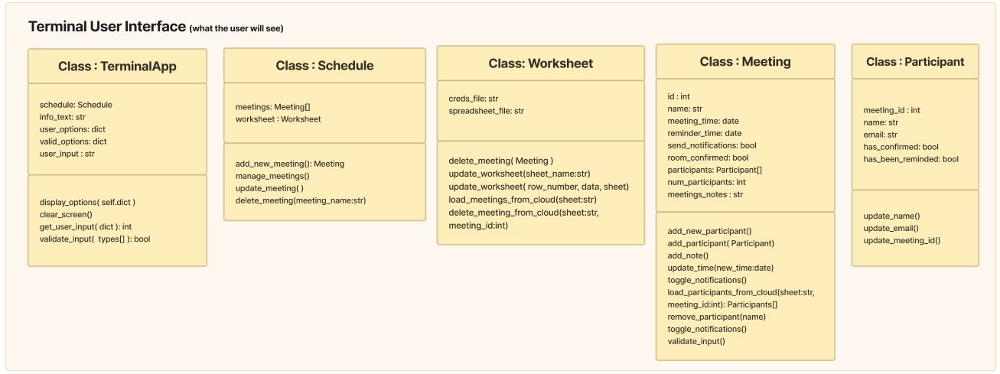

# Meetings reminders

This python-based terminal app is designed to organize meeting reminders. The goal is to free the user of low-level attention tasks that are associated with organizing meetings and keeping track that participants attend to the meeting. This is achieved by automatizing the process of sending meeting invitations and reminder emails.

Link to the live terminal : TO DO 

--- 

## Table of Contents

----
## User Experience (UX)

### User Stories 

<table  style="margin: 0 auto; width: 90%; ">
    <tr >
        <th style="min-width:20%">  </th>
        <th style='text-align:center' > USER STORIES </th>
    </tr>
    <tr>
        <td style="min-width:20%"> 1 </td>
        <td> I want to be able to filter my upcoming meetings so that I can see the upcoming meetings for the current week, the current month or all meetings quickly.   </td>
    </tr>
    <tr>
        <td> 2 </td>
        <td> I want to be able to add a new Meeting to my schedule so that i can freely change the meeting name, meeting time and date.   </td>
    </tr>
    <tr>
        <td> 3 </td>
        <td> I want to be able to modify the details of an existing meeting, so that i can correct and react to changes to the plan, by changing the meeting time, name, and participants that are invited.   </td>
    </tr>
    <tr>
        <td> 7 </td>
        <td>  I want to be able to remove a Meeting from my schedule, so that it is not in the schedule any more, for example if the meeting was cancelled.   </td>
    </tr>
    <tr>
        <td> 4 </td>
        <td>  I want to be able to add and remove participants to a meeting after a meeting has been created so that i can react to changes in the outer world (i.e. a participant had to cancel their attendance after originally having agreed to attend) </td>
    </tr>
    <tr>
        <td> 5 </td>
        <td> When i make changes to the meeting schedule, I want to able to save those changes so that they are still there when I open the application the next time. 
        </td>
    </tr>
    <tr>
        <td> 6 </td>
        <td>  While using the application, I want to have an option to discard the local changes and reset the schedule from the database.
        </td>
    </tr>
    <tr>
        <td> 7 </td>
        <td> I want to able to quickly change the time range how the upcoming meetings are displayed. In this way, I can quickly get an overview of the meetings from the current week, the current month, and all meetings that are scheduled.  </td>
    </tr>
    <tr>
        <td> 8 </td>
        <td> I want to be able to toggle the display into dark mode so that I can also easily read the information also with darker light conditions.   </td>
    </tr>
</table>

### Website Aims

<ul>
    <li> add an automation task that requires low-level attention to organzing an event or meetings </li>
    <li> reduce likelihood that meetings are missed, or that participants do not attend a meeting </li>
</ul>.
][='\\\\\\\------------]
- Item 1
- Item 2

### Opportunities 

<table  style="margin: 0 auto; width: 80%">
    <tr >
        <th > Description </th>
        <th> Impact </th>
        <th> Feasibility </th>
    </tr>
    <tr>
        <td> Create,Read ,Update or Delete a meeting  </td>
        <td> 5  </td>
        <td> 5  </td>
    </tr>
     <tr>
        <td> Create, Read, Update and Delete a participant of a meeting   </td>
        <td> 5  </td>
        <td> 5  </td>
    </tr>
    <tr>
        <td >  Add, remove and update notes attached to the reminder email   </td>
        <td> 5  </td>
        <td> 5  </td>
    </tr>
     <tr>
        <td style="max-width:200px"> Send a reminder to participants with a button press  </td>
        <td> 5  </td>
        <td> 5  </td>
    </tr>
    <tr>
        <td style="max-width:200px"> Send automatic reminder to participants who have not received a manual reminder email 24hrs before meeting   </td>
        <td> 5  </td>
        <td> 5  </td>
    </tr>
  <tr>
        <td> Display list of upcoming meetings and allow to browse details </td>
        <td> 5  </td>
        <td> 5  </td>
    </tr>
     <tr>
        <td> allow to turn on/off notifications for each meeting and participant </td>
        <td> 3  </td>
        <td> 4  </td>
    </tr>

    

</table>

--- 

### Feature selection

----- 

## Design

### Imagery

--- 

### Data Structures

The information about meetings and participants will be stored using Google sheets: 

<table style='max-width:80%; text-align: center'>
    <tr>
        <th style='text-align:center'> Python Class</th>
        <th style='text-align:center'> Flow Chart - Python</th>
    </tr>
    <tr>
        <td> Meeting Data </td>
        <td>   </td>
    </tr>
   <tr>
        <td> Particiant Data </td>
        <td>   </td>
    </tr>
</table>

--- 

### Implementation in Python  

The implementation will be divided into two Apps:
-  TerminalApp : User Terminal Application where the user can interact with the Meeting schedule
-  ReminderApp : A small worker application that sends reminders based on the Meeting schedule

These are the classes that will model the behaviour:
- Meeting Class: to describe details of the meeting (that consists of participants)
- Participant Class: to describe details of the participant
- Worksheet Class : describes interaction with Google Sheets (read/write)
- Schedule Class : to store and handle all scheduled Meetings 

<table style='max-width:70%'>
    <tr>
        <th style='text-align:center'> Python : Classes</th>
    </tr>
    <tr>
        <td>   </td>
    </tr>
</table>

----- 

## Wireframes

### Program Flow Chart

The functionality of the python program is displayed below. 

<table>
    <tr>
        <th style='text-align:center'> Flow Chart - Python</th>
    </tr>
    <tr>
        <td>   </td>
    </tr>
</table>

-----

## Features

### General Features 

### Future Implementations

- Add option for recurring meetings 
- Add option to connect to a calendar (Gmail, Outlook) to check for availability of participants
- send a calender invite (for simplicity, this project sends currently only emails) 
- create options for virutal meetings (i.e. add options for zoom)

### Accessibility

--- 

## Technologies Used 

-  Git / [Github](https://github.com/)  for Version Control 
- [VS Code ](https://code.visualstudio.com/) as local IDE  
- [ Code Anywhere ](.codeanywhere.com) as cloud IDE 
- [Figma](https://www.figma.com/) for the Flowchart 
- [W3 Validation Tools](https://validator.w3.org/) for Testing
- [Shields.io](https://shields.io/) for Readme badges
- [Markdown Beautifier](https://markdownbeautifier.com/#)  to format tables in this Readme
- convert markdown tables to html via [HTML Table Converter](https://tableconvert.com/markdown-to-html)
- Markdown [TOC Generator](https://ecotrust-canada.github.io/markdown-toc/)
- [Prettier](https://marketplace.visualstudio.com/items?itemName=esbenp.prettier-vscode) VS Code formatter 
- [Pseudo](https://marketplace.visualstudio.com/items?itemName=willumz.generic-pseudocode) VS Code plugin to write pseudocode

### Languages 

- HTML 
- Python

### Frameworks 

- 

### Python Packages 

<table style='max-width:70%'>
    <tr>
        <th style='text-align:center'>  Name</th>
        <th> Purpose </th>
    </tr>
        <tr>
        <td> textual / rich </td>
        <td> to create a terminal user interface</td>
    </tr>
    <tr>
        <td> black  </td>
        <td>  for standarized code formatting </td>
    </tr>
     <tr>
        <td> pytest </td>
        <td>   for unit tests  </td>
    </tr>  
       <tr>
        <td> email_validator </td>
        <td>   to validate that email has correct form  </td>
    </tr>  
    
</table>

----- 

## Deployment and Local Development 

Most of the features of this application run fine on a local computer (any interactions with the schedule such as read/delete/update meetings etc.). 
 A few notes: 
- For testing, you don't need a worksheet and can try it out directly with the mockdata by pressing 'M' in the main terminal - this will load the mock data used for testing instead of the worksheet
- However, to meet the requirements for assessment, the application will also run fine on Heroku 
- Running on Heroku will also demonstrate how to the schedule can synchronize with a worksheet and how reminders would be send to the selected participants.
- During development, I realized that sending Emails to arbitrary address, and allowing the user to send emails manually involves potential security risks and I will not include these opportunities. Especially because the source code is publicly available here on Github. 
- Instead, the emails will be **only sent automatically** and not manually by pressing a button as originally intended. 
- Also, the user will **not be able to add arbitrary participants** as this could allow hostile users to send Emails on behalf of this application. Instead, the user can select from a list of participants, and the Email sending functionality will run in the background.
- Note that this is not a major limitation regarding the aim of this application since most of the meetings that benefit from automation are those that happen frequently with the same people (i.e. staff meeting, townhall meetings, Journal Club)  

#### How to Fork

- Log into GitHub and navigate to this repository  
- Click on the "Main" Branch button and type the name of the forked branch
- Click on "Create Branch" to confirm

#### How to Clone

- Click on the "Code" button and copy the link to this repository
- open terminal on your machine and navigate to the folder you want to store a local copy
- in the terminal, type 'git clone ' followed by the link you copied
- press enter to confirm

### (Optional) How to set up your local python environment

- If you want to run this application on your local computer

#### Set Up Worksheets

- Create a personal google account (if needed)
- Go to Sheets
- Create New Sheet and rename to `Meeting-Reminders` 
    - rename first sheet to 'schedule'
    - add the Headings (and some dummy initial data if you want) 
    <table style='width:80%'>
        <tr>
            <th style='text-align:center'>Schedule Worksheet</th>
        </tr>
        <tr>
            <td>   </td>
        </tr>
    </table>
- add another sheet and name it 'valid-participants'
- add the Headings (and some dummy initial data if you want) 
    <table style='width:80%'>
        <tr>
            <th style='text-align:center'>Participants Worksheet</th>
        </tr>
        <tr>
            <td>   </td>
        </tr>
    </table>
- add another sheet and name it 'participation-matrix'
- This matrix is a binary graph that tells which participant is part of which meeting
    <table style='width:80%'>
        <tr>
            <th style='text-align:center'>Participation Matrix Worksheet</th>
        </tr>
        <tr>
            <td>   </td>
        </tr>
    </table>

### (Optional) Increase Security by protecting your Participant Worksheet

- If you just want to test the application you can use a single account for setting up the worksheet and accessing it from the application. This however may allow the application to change data inside the woksheet. 
- In order to protect the participant sheet from malicious changes, do following steps to lock the sheet from editing
    - Click Data > Protect Sheet and ranges
    - Select 'Add Sheet or Range' and select the 'valid-participants' sheet
    - Restrict edit to 'only me' 
- Crete a second google account for the application and invite it to the sheet (File > Share in the first account).
- This second user can now only read the participant sheet, but not edit it (while still being able to edit and read data on the schedule and participation-matrix sheet, which are harmless)
- Use this second user for API access from your application, and the first user only to manage the valid participants. 

--- 

### (Optional) Add Worksheet for Unittest with Pytest

- If you also want to pass all unit tests you need to add a fourth sheet 'unit-test' to the sheet
- This sheet is not necessary to run the application. However, for unit testing of the methods for reading/writing, we cannot use the main sheet because the user can edit those meetingsa and the unit test would fail (although the read/write methods are correct). 
- There are a few strategies to mitigate this problem including mocking of the worksheet. A better option was suggested on [stackoverflow]( https://stackoverflow.com/questions/1217736/how-to-write-unit-tests-for-database-calls) to instead connect to a known database and test the code with those sheets
- I modified this idea by adding a fourth sheet 'unit-test' to our google sheet that is not used by the app, just for the unit test, but mimicks exactly the columns as the first (schedule) sheet. This sheet will never be modifed by the app. We then assume: if the function works for reading and writing to the fourth sheet, it should work for the first and second as well.
- To add this sheet:
    - Go to your sheet `Meeting-Reminders` :
        - add another sheet and name it 'unit-test'
        - Enter the exact values from the sheet from the image. This is your expectation that pytest can now reference to within the unit test 
  <table style='width:80%'>
        <tr>
            <th style='text-align:center'>Unit Test Worksheet</th>
        </tr>
        <tr>
            <td>   </td>
        </tr>
    </table>

---- 
### Link Google API to the application 

- Go to Google Cloud Platform 
- Go to Dashboard and Select "New Project"
- Select a Name i.e. "MeetingReminders" and click > Create 
- Click > "Select Project" to go to project page 
- Click on sidebar >  "API and Services" > Library
- For the Google Drive API:
    - Search For "Google Drive" and select "Google Drive API" > Click "Enable" 
    - Click on "Create Credentials" > select "App Data", unselect "Kubernets" etc., then click 'Next'
    - Use an arbitrary Name for the account
    - Select Role "Basic > Editor"
    - Leave Blank the next 
    - Go to your Service Account and Add+Download a private json key from the 'keys' tab and store in a "creds.json" file (don't share this file with anyone and **double-check** that you will not push it accidentally to your github clone/fork. 
    - Before copying into your application folder, **ensure** that the name of your credential file is listed in your **.gitignore** to make sure these **will never be pushed to git**. )
- For the Google Sheets API :
    - Search For "Google Drive" and select "Google Drive API" 
    - Click "Enable" 
- open your creds file and copy the value of the "client_email" key into your clipboard 
- open your google sheet and click "share", and use this email that you copied above
- **IMPORTANT: Never push any sensitive information to your GitHub repository** 
    - this can be handled by a '.gitignore' file inside your repository that tells git to ignore files that are listed in this file
    - before copying your credential file into your repo folder, open '.gitignore'
    - add a new line 'creds.json' to this file (or same name as you saved your private key that your dowloaded in previous step)
    - push changes to github and check that 'creds.json' was not pushed (if you want, try this out first with an empty 'creds.json' before replacing with the actual private key)

---- 

### Deployment on Heroku 

- Heroku will requires public access to the `reminding` package inside your forked repository. Basically i followed [this explanation from Heroku](https://devcenter.heroku.com/articles/python-pip) 
- Create an account on [Heroku](https://dashboard.heroku.com/apps)
- Log into Heroku 
- Go to Dashboard and click on `New` > `New App`
- Choose a name i.e. my-meetings and region (EU) then click on `Create App`
- Connect with your forked repository on github
- Switch to `Settings` Tab
    - Config Vars and add `PORT` with value `8000`
    -  `NOTE FOR LATER` add here more credentials when adding config vars
    - On `Buildpacks` choose in that order (the order matters)
        -  `heroku/python` 
        -  `heroku/nodejs`
-   Switch to to `Deploy` Tab 
    - If you want to deploy just once, `Manual deply` section > Click on `Deploy Branch` 
    - If you want to deploy automatically after each commit to your repository, choose `Enable Automatic Deploys` on `Automatic Deploys` section

--- 

## Testing 

### Testing Procedure 
The website was tested extensively for several apsects , and the results were documented in [---TO DO ---TESTING.md](./TESTING.md) 

- Functionality
- User Stories
- Usability and Accessibility 
- Compatibility and Responsiveness 

Also, this website was developed using a `test-driven development` (TDD) approach using the `pytest` framework for python. Results of of the unit tests are documented in same document above. The reasons for TDD is to 
- ... ensure core functionality
- ... better code re-usability 
- ... better code readibility by enforcing smaller functions.

(clean code principles).

---

### Solved Bugs 

- After packaging the python code into an installable package ( so that we can use classes via `from reminding.meeting import Meeting`), the app would not deploy  on Heroku: 
    <table style='max-width:80%; text-align: left'>

    <tr>
    <td> Error Message</td>
    <td>    </td>
    </tr>
    <tr>
    <td> Solution</td>
    <td> 
    Setting the visibility of the repository from `private` to `public`. In this way, the `reminding` dependency from this repository could be installed successfully. There are other options for private repositories (see [Heroku Devcenter](https://devcenter.heroku.com/articles/python-pip) or [Stackoverflow ](https://stackoverflow.com/questions/21297755/heroku-python-dependencies-in-private-repos-without-storing-my-password)) but none of these were deemed safe or good practice (i.e. storing private SSH-KEYs as environment variable). Being mindful about the scope of this project, it was chosen to follow the easier and safer approach by setting visibility to 'public'. 
    </td>
    </tr>
    </table>

### Open Bugs 

---- 

## Credits 

### Code Used

- How to write emails from python [Link](https://towardsdatascience.com/how-to-easily-automate-emails-with-python-8b476045c151)
- How to schedule a python task on Heroku [Link](https://www.youtube.com/watch?v=qn3Obj56wfA)
- Textual Tutorial : Stopwatch Application [Link](https://textual.textualize.io/tutorial/)
- Starting point for pyproject.toml file [Link](https://github.com/tiangolo/fastapi/tree/master);

### Content 

- All of the content was written by myself.
- Externally used code (such as code snippets from stackoverflow or from tutorials) in this project are referenced in this Readme and inside the html or python source code. 

## Acknowledgements

- Teaching and Support from Code Insitute [Code Insitute](https://codeinstitute.net/)
- How to setup python packages that are testable with pytest 
    - Good Integration Practices for pytest [Link](https://docs.pytest.org/en/7.1.x/explanation/goodpractices.html)
    - Packaging Python Projects [Link](https://packaging.python.org/en/latest/tutorials/packaging-projects/)
    - James' Murphys Yotube Tutorial for unit testing with python [Link](https://youtu.be/DhUpxWjOhME)
    - Effective Python Testing with Pytest [Link](https://realpython.com/pytest-python-testing/)
    - Okken, Brian. "Python Testing with pytest." Pragmatic Bookshelf, 2022.
- Console-based Terminal User Interface by William McGugan [GitHub Textual](https://github.com/textualize/textual/)
- How to setup up Google Gmail / EZGmail API [Al Sweikarts's ezgmail Github](https://github.com/asweigart/ezgmail)
- Example Readme from Kera Cudmore [Kera's Github](https://github.com/kera-cudmore/readme-examples/blob/main/milestone1-readme.md)
- Images from  [Pexels](https://pexels.com/)  in case you use a BG image (check this!)
- explanation how to solve inheritance issues with dataclassess [Python dataclass inheritance, finally !](https://medium.com/@aniscampos/python-dataclass-inheritance-finally-686eaf60fbb5)
- examples from pytest about parametrized tests [pytest docs](https://docs.pytest.org/en/7.1.x/example/parametrize.html) 
- tutorials for unit python unit testing with pytest (update this once you started using it) 
    - Pytest Unit Testing Tutorial - How to test your Python code [pixegami (Youtube)](https://www.youtube.com/watch?v=YbpKMIUjvK8)
    - why to use dataclass decorators [mCoding (Youtube)](https://www.youtube.com/watch?v=vBH6GRJ1REM)
    - Automated Testing in Python with pytest, tox, and GitHub Actions [mCoding (Youtube) ](https://www.youtube.com/watch?v=DhUpxWjOhME)
    - Pytest: How to use fixtures as arguments in parametrize [Article](https://engineeringfordatascience.com/posts/pytest_fixtures_with_parameterize/)
- Talks from Dylan Israel about Unit Testing: [Clean Code (Youtube)](https://youtu.be/YQsU2Zq2Zis) 
- Last but not least : Thanks to my mentor Ronan (Code Institute) for his advices and clear feedback 

--

 
 
 
 
 
 
 
 
 
 
 

terminal : 80 characters wide and 24 rows high

 
 

Welcome,

This is the Code Institute student template for deploying your third portfolio project, the Python command-line project. The last update to this file was: **March 14, 2023**

## Reminders

- Your code must be placed in the `run.py` file
- Your dependencies must be placed in the `requirements.txt` file
- Do not edit any of the other files or your code may not deploy properly

## Creating the Heroku app

When you create the app, you will need to add two buildpacks from the _Settings_ tab. The ordering is as follows:

1. `heroku/python`
2. `heroku/nodejs`

You must then create a _Config Var_ called `PORT`. Set this to `8000`

If you have credentials, such as in the Love Sandwiches project, you must create another _Config Var_ called `CREDS` and paste the JSON into the value field.

Connect your GitHub repository and deploy as normal.

## Constraints

The deployment terminal is set to 80 columns by 24 rows. That means that each line of text needs to be 80 characters or less otherwise it will be wrapped onto a second line.

---

Happy coding!
