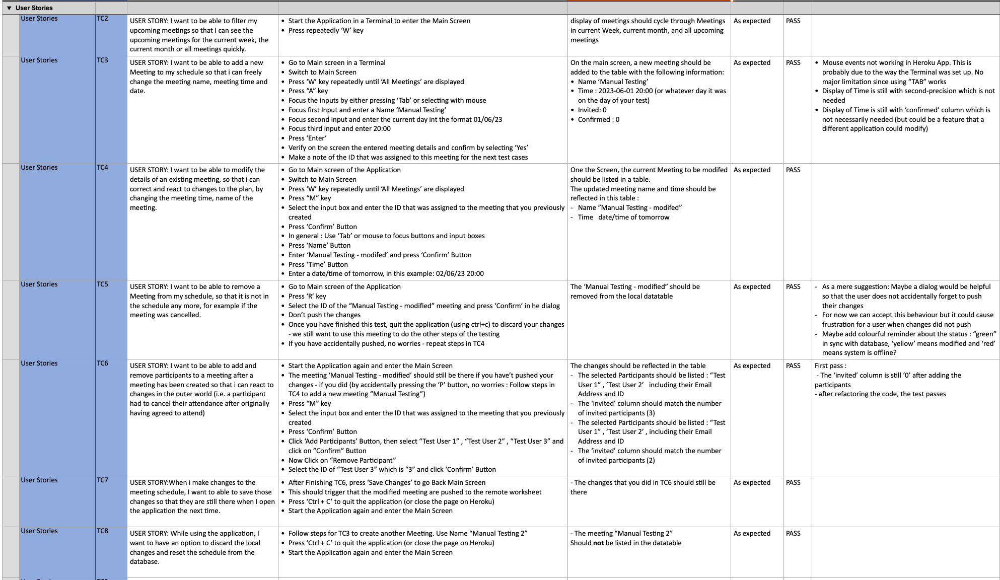
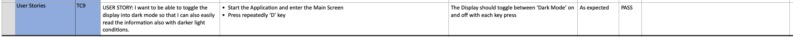
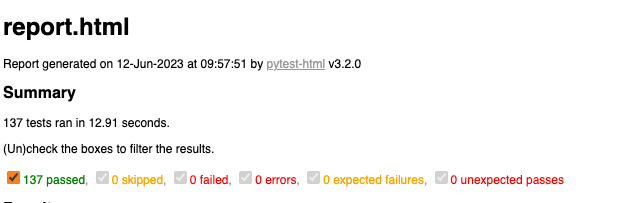
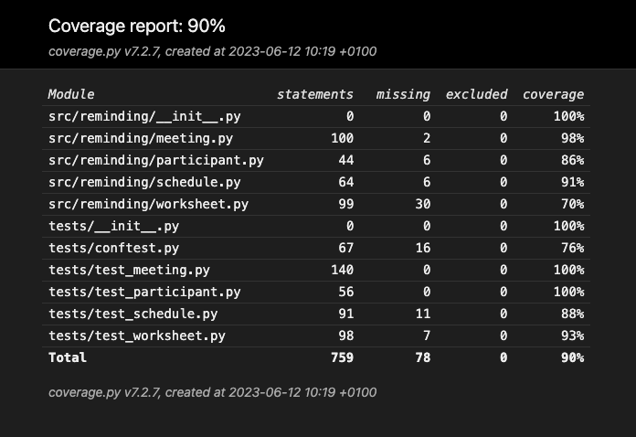
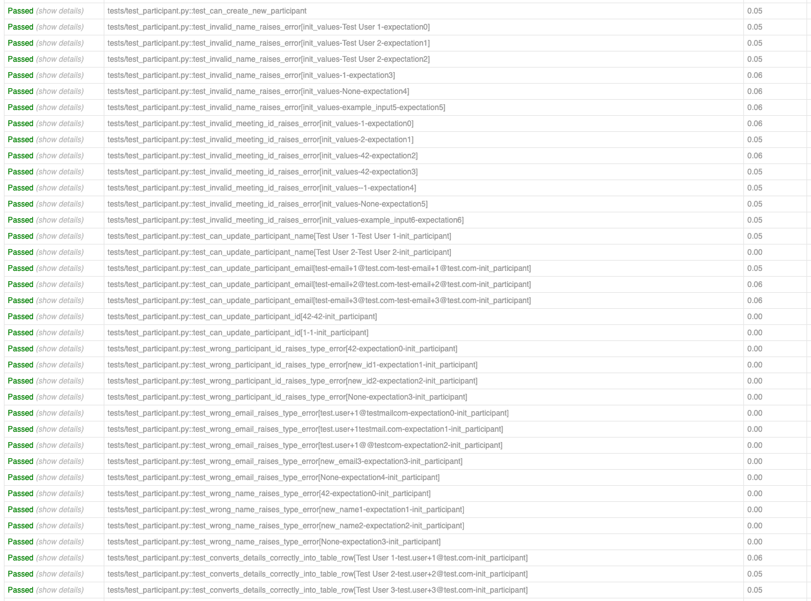
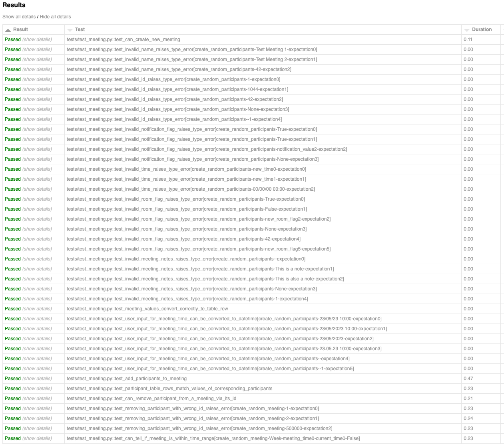
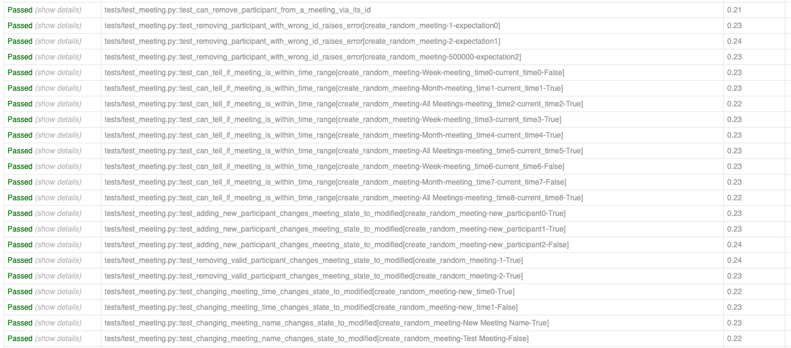
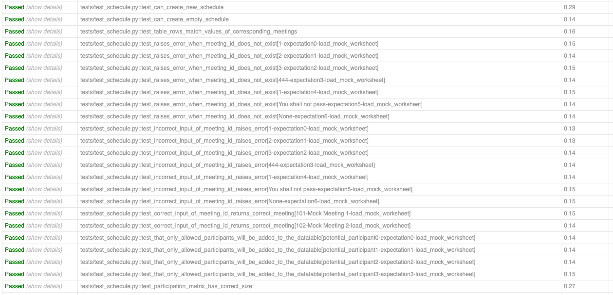
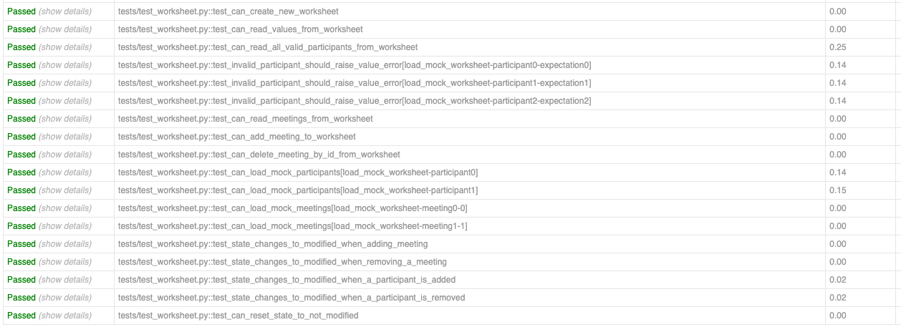

# TESTING 

---
## Table of Contents 

- [TESTING](#testing)
  - [Table of Contents](#table-of-contents)
  - [Manual Testing](#manual-testing)
    - [Results of Syntax Validation with PEP8](#results-of-syntax-validation-with-pep8)
    - [Results of User Stories Test](#results-of-user-stories-test)
    - [Results of Functionality Tests](#results-of-functionality-tests)
    - [Results of Other Tests](#results-of-other-tests)
    - [Issues Found During Manual Testing](#issues-found-during-manual-testing)
  - [Automated Testing](#automated-testing)
    - [Results of Automated Testing with Pytest](#results-of-automated-testing-with-pytest)
    - [Results of Unit Testing with Pytest](#results-of-unit-testing-with-pytest)
      - [Participant Class](#participant-class)
      - [Meeting Class](#meeting-class)
      - [Schedule Class](#schedule-class)
      - [Worksheet Class](#worksheet-class)

--- 

## Manual Testing

The Manual Testing document can be found here : [Numbers Testing Results](./assets/documentation/Manual-Testing-Results.numbers).

### Results of Syntax Validation with PEP8

The application has been tested that a pylinter does not flag any significant errors. All testes have passed.

<table style='width:100%'>
    <tr>
        <th style='text-align:center'>Test Results - Syntax Validation</th>
    </tr>
    <tr>
       <td>   </td>
    </tr>
</table>

### Results of User Stories Test 

The application has been tested for its user stories case-by-case. All testes have passed.

<table style='width:100%'>
    <tr>
        <th style='text-align:center'>Test Results - User Stories</th>
    </tr>
    <tr>
       <td>   </td>
    </tr>
     <tr>
       <td>   </td>
    </tr>
</table>

### Results of Functionality Tests

The application has been tested that it works functionally correct. All testes have passed.

<table style='width:100%'>
    <tr>
        <th style='text-align:center'>Test Results - Functionality</th>
    </tr>
    <tr>
       <td>   </td>
    </tr>
</table>

### Results of Other Tests

The application has been tested for error handling and consistency across browsers of the deployed version on Heroku. All testes have passed.

<table style='width:100%'>
    <tr>
        <th style='text-align:center'>Test Results - Deployment </th>
    </tr>
    <tr>
       <td>   </td>
    </tr>
</table>

### Issues Found During Manual Testing

There were several issues found during Manual Testing that required refactoring of the code to make it pass the test. 

<table style="width:90%">
    <tr>
        <th style="text-align:center"> Test Case</th>
        <th style="width:45%"> Description </th>
        <th style="width:45%"> Errors Found  </th>
    </tr>
    <tr>
      <td style="text-align:center"> TC1  </td>
      <td> Validate that python modules pass PEP8 Validator with no significant issues   </td>
      <td> Various warnings and one error in the first pass, including: 
          <ul>
            <li>  warning regarding Line Too Long </li>
            <li>  warning regarding order of standard imports </li>
            <li>  warning regarding missing docstrings </li>
            <li>  warning regarding catchting a too general Exception </li>
            <li>  error regarding: Non-iterable value self.query('Checkbox') is used in an iterating context</li>
         </ul> 
         All warnings have been addressed in the code. After refactoring, all warnings disappeared. Error was addressed separately (see next item in table for TC1)
      </td>
    </tr>
  <tr>
      <td style="text-align:center"> TC1 (second pass) </td>
      <td> Validate that python modules pass PEP8 Validator with no significant issues  </td>
      <td> The line:  " checkbox in self.query("Checkbox") "
        raised a PEP8 error. Textuals `query` method does not return iterables and therefore rasied this error. After converting the output of the `query` into an iterable, all tests passed.
      </td>
    </tr>
    <tr>
      <td style="text-align:center"> TC3  </td>
      <td> User Story : Interact with the application using key and mouse inputs  </td>
      <td> Various errors in the first pass, including: 
          Mouse events not working in Heroku App. This is probably due to the way the Terminal was set up. No major limitation since using “TAB” works. On local terminal, mouse events are working.
         All warnings have been addressed in the code. After refactoring, the validation passed.
      </td>
    </tr>
    <tr>
      <td style="text-align:center"> TC5  </td>
      <td> User Story : Remove a Meeting from a Schedule </td>
      <td> Not an error, but a note : a dialog or some visual cue would be helpful so that the user does not accidentally forget to push their changes. Added to Future Implmenetations. 
      </td>
    </tr>
    <tr>
      <td style="text-align:center"> TC14 </td>
      <td> Verify consistency of the “Push” option to update the remote database with the local changes </td>
      <td> Not an error, but a note : It would be nice to have a dialog or some visual feedback that syncing of the local changes with the remote repository has been successful. Implemented in the latest version. 
      </td>
    </tr>
    <tr>
      <td style="text-align:center"> TC19 </td>
      <td> Validate that application handles the case when internet connection is lost  </td>
      <td> An Error was discovered that the Application should display to user that it could not connect to the database. After refactoring, test passes. 
      </td>
    </tr>
 </table>

--- 

## Automated Testing 

This project has been implemented using a `test-driven` approach, where each bit of functionality was added incrementally using a `red-green-refactor` cycle.
- One of the advantages of this approach was that code changes that negatively affected other parts of the codebase were flagged immediatley while implementing these changes. It was also much easier to refactor methods and classes since functionality could continously be tested by keeping the test output in `green`. 
- While it may slightly increase the time to develop the tests in parallel to the function, ultimately it saved time by reducing the time needed for finding bugs. It also greatly increased confidence that the code was doing exactly as intended. 
- On the first approach, also the I/O access to the google sheets was included during the Unit Tests. This has turned out to a wrong approach and lead to Google flagging `bot-like` activity on the google sheets when running `pytest`.  A description of this (wrong) approach is left in an appendix Markdown file :  [Lesson learned for Automated Testing APIs.MD](APPENDIX.md) 
- As a consequence, it was focussed on testing the correct functioning of each class and method used in this project. The only excepion were methods for direct I/O to the Google sheets, which were only tested during Manual testing. 
  
### Results of Automated Testing with Pytest

The follwing section contains a summary of the results from Unit Testing using the Pytest Framework. 

- 137 Unit Tests were used in this project, all tests passed. Summary can be found [Here](./assets/documentation/report.html)
- Coverage of the unit tests was 90%

<table style='width:100%'>
    <tr>
        <th style='text-align:center'>Pytest Summary</th>
    </tr>
    <tr>
       <td>   </td>
    </tr>
</table>

<table style='width:100%'>
    <tr>
        <th style='text-align:center'>Pytest Coverage</th>
    </tr>
    <tr>
       <td>   </td>
    </tr>
</table>

--- 
### Results of Unit Testing with Pytest 

#### Participant Class

The `Participant` class was tested for : 
- valid constructor calls
- valid input of Name, Email, Participant ID
- valid conversion into a row format for I/O of Google Sheets

All tests passed.

<table style='width:100%'>
    <tr>
        <th style='text-align:center'>Pytest Summary</th>
    </tr>
    <tr>
       <td>   </td>
    </tr>
</table>

#### Meeting Class 

The `Meeting` class was tested for : 

- valid constructor calls
- valid input of Name, Time, Meeting ID
- valid conversion into a row format for I/O of Google Sheets
- ability to create, read, update and remove a meeting
- ability to add, update and remove participants from a meeting
- ability to select a correct time range (week/month/all meetings)
- ability to detect whether meeting details have been modified 

All tests passed. 

<table style='width:100%'>
    <tr>
        <th style='text-align:center'>Pytest Summary</th>
    </tr>
    <tr>
       <td>   </td>
    </tr>
      <tr>
       <td>   </td>
    </tr>
</table>

#### Schedule Class 

The `Schedule` class was tested for : 

- valid constructor calls
- valid conversion between list of meetings and table rows 
- ability to update and correctly print details of scheduled meetings
- ability to detect whether schedule details have been modified 
- correct functioning of the CRUD methods for the participation matrix and a check for its correct format

All tests passed. 

<table style='width:100%'>
    <tr>
        <th style='text-align:center'>Pytest Summary</th>
    </tr>
    <tr>
       <td>   </td>
    </tr>
</table>

#### Worksheet Class 

The `Worksheet` class was tested for : 

- valid constructor calls
- valid CRUD functionality for both schedule and participant sheet (only testing the format - not the actual API I/O)
- ability to detect whether worksheet details have been modified , and to reset its state 

All tests passed. 

<table style='width:100%'>
    <tr>
        <th style='text-align:center'>Pytest Summary</th>
    </tr>
    <tr>
       <td>   </td>
    </tr>
</table>

-----
