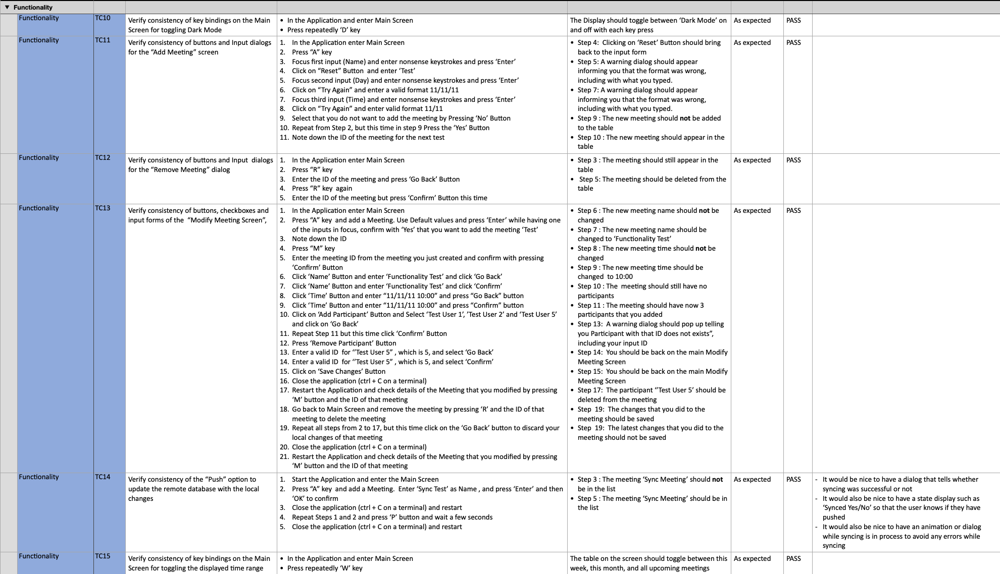

# TESTING 

---
## Table of Contents 

- [TESTING](#testing)
  - [Table of Contents](#table-of-contents)
  - [Manual Testing](#manual-testing)
    - [Results of Functionality Tests](#results-of-functionality-tests)
    - [Results of User Stories Test](#results-of-user-stories-test)
    - [Results of Syntax Validation with PEP8](#results-of-syntax-validation-with-pep8)
    - [Results of Other Tests](#results-of-other-tests)
    - [Issues Found During Manual Testing](#issues-found-during-manual-testing)
  - [Automated Testing](#automated-testing)
    - [Setup of Automated Testing with Pytest](#setup-of-automated-testing-with-pytest)
    - [Results of Unit Testing with Pytest](#results-of-unit-testing-with-pytest)
      - [Participant Class](#participant-class)
      - [Meeting Class](#meeting-class)
      - [Schedule Class](#schedule-class)
      - [Worksheet Class](#worksheet-class)

--- 

## Manual Testing

The Manual Testing document can be found here : [Numbers Testing Results](./assets/documentation/Manual-Testing-Results.numbers).

### Results of Functionality Tests

The application has been tested that it works functionally correct. All testes have passed except TC19 which failed. Working on a fix is scheduled. 

<table style='width:100%'>
    <tr>
        <th style='text-align:center'>Test Results - Functionality</th>
    </tr>
    <tr>
       <td>   </td>
    </tr>
</table>

### Results of User Stories Test 

The application has been tested for its user stories case-by-case. All testes have passed.

<table style='width:100%'>
    <tr>
        <th style='text-align:center'>Test Results - User Stories</th>
    </tr>
    <tr>
       <td>   </td>
    </tr>
</table>

### Results of Syntax Validation with PEP8

The application has been tested that a pylinter does not flag any significant errors. All testes have passed.

<table style='width:100%'>
    <tr>
        <th style='text-align:center'>Test Results - Syntax Validation</th>
    </tr>
    <tr>
       <td>   </td>
    </tr>
</table>

### Results of Other Tests

The application has been tested for consistency across browsers of the deployed version on Heroku. All testes have passed.

<table style='width:100%'>
    <tr>
        <th style='text-align:center'>Test Results - Deployment </th>
    </tr>
    <tr>
       <td>   </td>
    </tr>
</table>

### Issues Found During Manual Testing

There were several issues found during Manual Testing that required refactoring of the code to make it pass the test. 

<table style="width:90%">
    <tr>
        <th style="text-align:center"> Test Case</th>
        <th style="width:45%"> Description </th>
        <th style="width:45%"> Errors Found  </th>
    </tr>
    <tr>
      <td style="text-align:center"> TC1  </td>
      <td> Validate that python modules pass PEP8 Validator with no significant issues   </td>
      <td> Various errors in the first pass, including: 
          <ul>
            <li>  warning regarding Line Too Long </li>
            <li>  warning regarding order of standard imports </li>
            <li>  warning regarding missing docstrings </li>
            <li>  warning regarding catchting a too general Exception </li>
            <li>  Flagged a ‘Non-iterable value used in an iterating context</li>
         </ul> 
         All warnings have been addressed in the code. After refactoring, the validation passed.
      </td>
    </tr>
    <tr>
      <td style="text-align:center"> TC3  </td>
      <td> User Story : Interact with the application using key and mouse inputs  </td>
      <td> Various errors in the first pass, including: 
          Mouse events not working in Heroku App. This is probably due to the way the Terminal was set up. No major limitation since using “TAB” works. On local terminal, mouse events are working.
         All warnings have been addressed in the code. After refactoring, the validation passed.
      </td>
    </tr>
    <tr>
      <td style="text-align:center"> TC5  </td>
      <td> User Story : Remove a Meeting from a Schedule </td>
      <td> Not an error, but a note : a dialog or some visual cue would be helpful so that the user does not accidentally forget to push their changes. Added to Future Implmenetations. 
      </td>
    </tr>
    <tr>
      <td style="text-align:center"> TC14 </td>
      <td> Verify consistency of the “Push” option to update the remote database with the local changes </td>
      <td> Not an error, but a note : It would be nice to have a dialog or some visual feedback that syncing of the local changes with the remote repository has been successful. Added to Future Implmenetations. 
      </td>
    </tr>
    <tr>
      <td style="text-align:center"> TC19 </td>
      <td> Validate that application handles the case when internet connection is lost  </td>
      <td> An Error was discovered that the Application should display  to user that it could not connect to the database. Working on a refactoring of a code before submission. 
      </td>
    </tr>
 </table>

--- 

## Automated Testing

- This project has been implemented using a `test-driven` approach, where each bit of functionality was added incrementally using a `red-green-refactor` cycle 
- One of the advantages of this approach that code changes at a later timepoint that negatively affect other parts of the codebase are flagged early on during development while working on the function 
- While it may slightly increase the time to develop the tests in parallel to the function, ultimately it saves time by reducing the time needed for finding bugs.

The follwing section contains: 
  - Setup of the database used during Unit Testing
  - Results of Unit Tests 

### Setup of Automated Testing with Pytest

- If you also want to pass all unit tests you need to add a fourth sheet 'unit-test' to the sheet
- This sheet is not necessary to run the application. However, for unit testing of the methods for reading/writing, we cannot use the main sheet because the user can edit those meetings and the unit test would fail (although the read/write methods are correct). 
- There are a few strategies to mitigate this problem including mocking of the worksheet. A better option was suggested on [stackoverflow]( https://stackoverflow.com/questions/1217736/how-to-write-unit-tests-for-database-calls) to instead connect to a known database and test the code with those sheets
- I modified this idea by adding a fourth sheet 'unit-test' to our google sheet that is not used by the app, just for the unit test, but mimicks exactly the columns as the first (schedule) sheet. This sheet will never be modifed by the app. We then assume: if the function works for reading and writing to the fourth sheet, it should work for the first and second as well.
- This is how the unit test worksheet looks like:

<table style='width:80%'>
    <tr>
        <th style='text-align:center'>Unit Test Worksheet</th>
    </tr>
    <tr>
       <td>   </td>
    </tr>
</table>

--- 
### Results of Unit Testing with Pytest 

#### Participant Class

#### Meeting Class 

#### Schedule Class 

#### Worksheet Class 

-----
